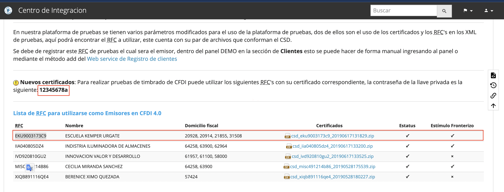
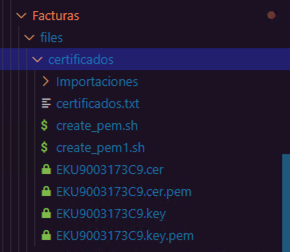

# Configuración de certificados .key .rem

Se require configurar los certificados ya que se usan para generar timbrados dentro de Direksys con estos 2 se genera el sello y el certificado que se ve en los xml para facturas en direksys.

Si no estan configurados estos 2 archivos tanto el sello como el certificado estaran vacios.

Ejemplo:

```xml
<?xml version="1.0" encoding="UTF-8"?>
<cfdi:Comprobante xmlns:xsi="http://www.w3.org/2001/XMLSchema-instance" xmlns:cfdi="http://www.sat.gob.mx/cfd/3" xsi:schemaLocation="http://www.sat.gob.mx/cfd/3 http://www.sat.gob.mx/sitio_internet/cfd/3/cfdv33.xsd" 
    Version="3.3" 
    Fecha="2022-02-01T14:12:13" 
    Moneda="MXN" 
    TipoDeComprobante="I" 
    NoCertificado="30001000000400002434" 
    LugarExpedicion="03910" 
    Serie="TLOD" 
    Folio="1928097"
    FormaPago="01" 
    MetodoPago="PUE" 
    Descuento="0.01" 
    SubTotal="1441.25" Total="1671.84"
    Sello="aZ1sm9WdMJls1zyf2OH4q3c..." 
    Certificado="MIIFuzCCA6OgAwIBAgIUMzA...">
  <cfdi:Emisor Rfc="EKU9003173C9" Nombre="TMK Logistics, S.A de C.V." RegimenFiscal="601"/>
  <cfdi:Receptor Rfc="XAXX010101000" Nombre="LUIS EDUARDO ALCANTARA OLVERA" UsoCFDI="G01"/>
  <cfdi:Conceptos>
    <cfdi:Concepto ClaveProdServ="52121505" ClaveUnidad="H87" NoIdentificacion="100832374" Cantidad="1.00" Unidad="PZA" Descripcion="100832374 - SOGNARE ORTHOPEDIC" ValorUnitario="1292.24" Importe="1292.24">
      <cfdi:Impuestos>
        <cfdi:Traslados>
          <cfdi:Traslado Base="1292.24" Impuesto="002" TipoFactor="Tasa" TasaOCuota="0.160000" Importe="206.76"/>
        </cfdi:Traslados>
      </cfdi:Impuestos>
      <cfdi:Parte ClaveProdServ="52121505" NoIdentificacion="100832374" Cantidad="1" Descripcion="400006996 - SOGNARE ORTHOPEDIC" Unidad="PZA"/>
    </cfdi:Concepto>
    <cfdi:Concepto ClaveProdServ="52121505" ClaveUnidad="H87" NoIdentificacion="100832374" Cantidad="1.00" Unidad="PZA" Descripcion="100832374 - SOGNARE ORTHOPEDIC" ValorUnitario="0.01" Importe="0.01" Descuento="0.01">
      <cfdi:Parte ClaveProdServ="52121505" NoIdentificacion="100832374" Cantidad="1" Descripcion="400006996 - SOGNARE ORTHOPEDIC" Unidad="PZA"/>
    </cfdi:Concepto>
    <cfdi:Concepto ClaveProdServ="80141600" ClaveUnidad="H87" NoIdentificacion="600001012" Cantidad="1.00" Unidad="PZA" Descripcion="600001012 - ENVIO Y MANEJO" ValorUnitario="149.00" Importe="149.00">
      <cfdi:Impuestos>
        <cfdi:Traslados>
          <cfdi:Traslado Base="149.00" Impuesto="002" TipoFactor="Tasa" TasaOCuota="0.160000" Importe="23.84"/>
        </cfdi:Traslados>
      </cfdi:Impuestos>
      <cfdi:Parte ClaveProdServ="52121505" NoIdentificacion="100832374" Cantidad="1" Descripcion="400006996 - SOGNARE ORTHOPEDIC" Unidad="PZA"/>
    </cfdi:Concepto>
  </cfdi:Conceptos>
  <cfdi:Impuestos TotalImpuestosTrasladados="230.60">
    <cfdi:Traslados>
      <cfdi:Traslado Impuesto="002" TipoFactor="Tasa" TasaOCuota="0.160000" Importe="230.60"/>
    </cfdi:Traslados>
  </cfdi:Impuestos>
</cfdi:Comprobante>
```

# Descargar de archivos desde Finkok

NOTA: Estos pasos son para que puedas descargar y crear los archivos necesarios sin envargo se puede saltar al apartado: **Descargar archivos necesarios sin stackoverflow y sin finkok** en este apartado se descargan todo lo necesario sin necesidad de hacer más.

Para configurar los archivos los puedes descargar del proveedor finkok o tambien puedes pedir que alguien del equipo te comparta los archivos.

Para descargar con el proveedor accede a la siguiente ruta: [Finkok](https://wiki.finkok.com/doku.php?id=pruebas)

Para poder acceder te pedira un usuario y password por lo que es necesario solicitar estos accesos.

Si pudiste acceder puedes descargar los que pertenecen al RFC EKU9003173C9 como se ve en la imagen:



El archivo .zip contendra el archivo .cer y .key. Para una mejor comprension es mejor renombrar estos 2 archivos con el nombre EKU9003173C9.cer y EKU9003173C9.key ya que alfinal de cuentas estos 2 archivo pertenecen a ese RFC.

Para continuar con este proceso se puede seguir revisando el siguiente link de [stackoverflow](https://stackoverflow.com/c/direksys/questions/47) en donde te muestra como generar los 2 archivos .cer.pem y key.pem.

## Información general para el link de stackoverflow

El link de arriba hace referencia a este archivo por lo que es necesario crear un archivo llamado **create_pem.sh**.

```bash
# !/bin/bash
echo -e "\nTransformando Certificados .cer \n"
for archivo in *cer
do
	echo $archivo
	openssl x509 -inform DER -outform PEM -in $archivo -out $archivo.pem
	openssl x509 -inform DER -in $archivo -noout -serial >> "certificados.txt"
done
echo -e "\nTransformando Certificados .key \n"
for archivo in *key
do
	echo $archivo.pem
	openssl pkcs8 -inform DER -in $archivo -out $archivo.pem # -passin pass:'SUR3548j' 
done
```

Una vez creado el archivo debes dar permisos con el siguiente comando:

``sudo chmod 764 create_pem.sh``

Los siguientes pasos estan en el link de [stackoverflow](https://stackoverflow.com/c/direksys/questions/47).

# Descargar archivos necesarios sin stackoverflow y sin finkok

En el paso anterios se usa el link de finkok y el link de stackoverflow para poder crear los archivos necesarios pero recodremos que estos archivos solo son utilies para las pruebas por lo que no es tan necesario recrear los .cer.pem y .key.pem. para esto se comparten los archivos ya generados para que los puedas descargar y usar. 

Para esto descarga los siguientes archivos:

1. [create_pen.sh](./certificados/create_pen.sh)
2. [EKU9003173C9.cer](./certificados/EKU9003173C9.cer)
3. [EKU9003173C9.key](./certificados/EKU9003173C9.key)
4. [EKU9003173C9.cer.pem](./certificados/EKU9003173C9.cer.pem)
5. [EKU9003173C9.key.pem](./certificados/EKU9003173C9.key.pem)
6. [certificados.txt](./certificados/certificados.txt)

Estos archivos se deben colocar en la siguiente ruta como se puede ver en la imagen:

``dev2.direksys.com\httpdocs\finkok\Facturas\files\certificados``

Si la carpeta files y certificados no existe hay que crearlos:



Una ves creadas las carpetas y ya con los archivos dentro de ella hay que dar permiso directo a la carpeta files con el siguiente comando: 

``sudo chown -R tu-usuario:www-data files``

Recuerda cambiar tu usuario de la maquina virtual.

Solo con eso ya deberias poder timbrar de forma correcta lo cual puedes probar. Primero creando una orden nueva o si ya existe una puedes ejecutar el siguiente link:

Recuerda sustituir el texto: le.direksys.com por el que tu hayas colocado en tu hosts.

Timbrar version 3.3

``http://le.direksys.com/finkok/Facturas/test.php?e=2&id_invoices=2145857&v=3.3&sign=0``


Timbrar version 4.0 (Proximamente):

``http://le.direksys.com/finkok/Facturas/test.php?e=2&id_invoices=2145857&v=3.3&sign=0``