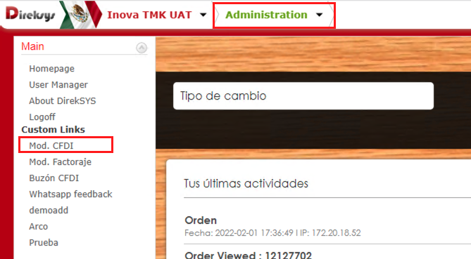
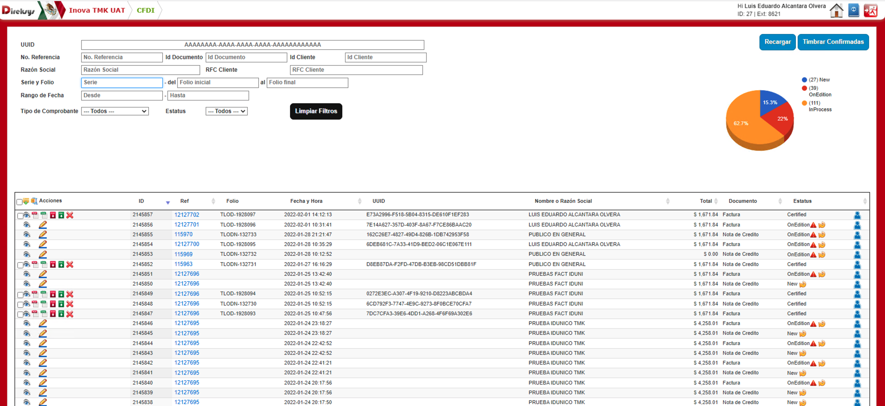

[< Regresar al Inicio](../index.md)

# Introducción

En Direksys existe el modulo de CFDI al cual se puede acceder por medio de la siguiente forma: Dentro del Modulo de Administración -> En el menu de Main se debe acceder a Mod. CFDI

Al ingresar se puede ver la siguiente vista:

Si en tu caso no se ve de esta forma debes inicar la configuracion para poder acceder a esta vista: [Configuración del módulo CFDI.](./configuracion-cfdi.md)

[< Regresar al Inicio](../index.md)