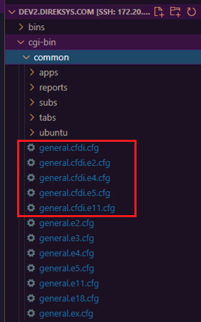

[< Regresar al Inicio](../README.md)

# Levantar módulo CFDI

Al igua que el levantamiento de Direksys el modulo de CFDI cuenta con archivos de configuracion necesarios. El resultado final que se busca es la creacion de los archivos de configuracion como lo vemos en la siguiente imagen:

Los archivos mostrados en la imagen se pueden copiar de la siguiente ruta del mismo proyecto:

``dev2.direksys.com\cgi-bin\common\ubuntu\uat\general.cfdi.cfg``

Solo se deben copiar de la ruta que se muestra arriba y pasar a la siguente ruta ruta:

``dev2.direksys.com\cgi-bin\common\ubuntu\general.cfdi.cfg``

Por ultimo de igual forma que con la configuracion de Direcksys se debe acceer a los archivos y configurar las partes necesarias.

# Configuracion archivo general.cfdi.cfg

Los cambios en este archivo son pocos ya que solo hay que modificar las rutas de nuestro proyecto 

Por ejemplo en la siguiente liena vemos que hace referencia a ``direksys.com`` lo cual deberia decir ``dev2.direksys.com`` ya que hace referencia a la ruta del proyecto.

``conf|sess_auth_dir=/home/www/domains/sandbox.direksys.com/cgi-bin/sessions/``

Solo debemos modificar todas las lineas que hacen referencia al proyecto a la ruta correcta de nuestro proyecto:

Esta linea quedaria así:

``conf|sess_auth_dir=/home/www/domains/dev2.direksys.com/cgi-bin/sessions/``

Pur ultimo se debe tener en cuenta que este modulo se comunica por medio de un api a: ``https://api.direksys.com/api/getInvoice`` por lo que en este y todos los archivos de configuracion siguientes se debe validar que apunte a: ``https://apiuat.direksys.com/api/getInvoice``

En realidad la configuracion de la api ya esta pero en mejor que se valide y en caso de que apunte a api solo modificar para apuntar a apiuat.

# Configuracion archivo general.cfdi.e2.cfg

Al igual que el archivo de general.cfdi.cfg se deben validar que apunte al proyecto asi mismo se debe validar la ruta a la que apunta la api.

Ejemplo:

Antes

``conf|sess_auth_dir=/home/www/domains/uat.direksys.com/cgi-bin/sessions/e2/``

Ahora:

``conf|sess_auth_dir=/home/www/domains/dv2.direksys.com/cgi-bin/sessions/e2/``

En este archivo se especifica la comunicacion con un proveedor que ayuda en el tema de timbrado de facturas. El proveedor se llama finkok y se debe revisar que la ruta de su servicio sea la de demo:

``conf|finkok_soap_host=http://demo-facturacion.finkok.com/servicios/soap/``

Si todo esta de forma correcta esto es lo mismo que se tiene que hacer con los siguientes archivos.

En este punto ya se deberia ver el sistema de forma correcta: [Introducción](./introduccion.md)

[< Regresar al Inicio](../README.md)
