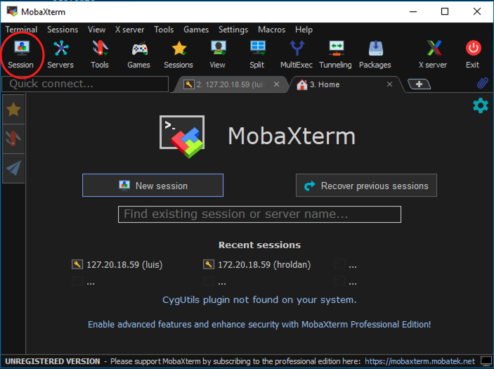
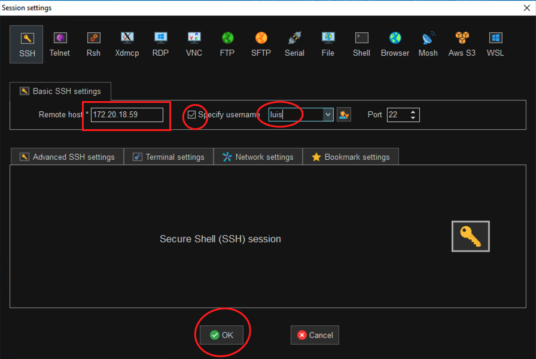
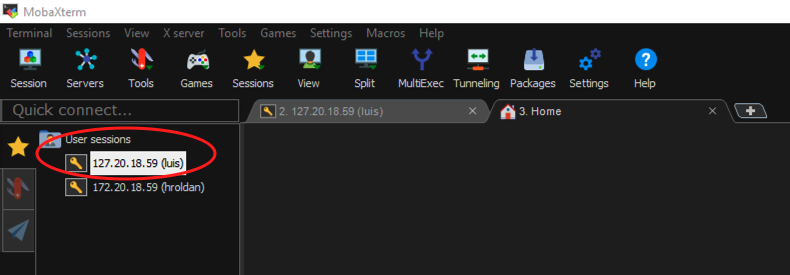
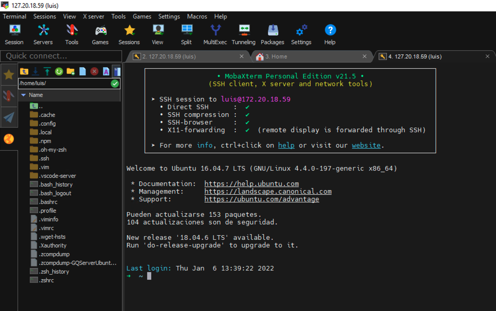

[< Regresar al Inicio](./index.md)

[< Regresar al Crear usuario en linux](./crear-usuario-en-linux.md)

## Acceder por SSH (Ejemplo con MobaXterm)

Al iniciar con moba solo da click en el boton Session.

Ingresamos la ip de la maquina virtual y le decimos que se usara un nombre de usuario, por ultimo solo da click en **OK**

El paso anterior puede hacer 2 cosas 
1. La primera te abre una nueva pestaña donde te solicita el password de la cuenta si ese es el caso solo escribe la contraseña y da enter (Recuerda que en linux la contraseña no se ve)
2. Si no te abrio la pestaña solo da doble click en la ip que se marca en la imagen 

Antes de ver esta imagen moba te preguntara si quieres que guarde la contraseña para que no la estes escribiendo las siguientes veces. Si lo haces te solicitara la contraseña de tu usuario par poder guardar.

Por ulitmo debes ver algo como esto:

[< Regresar al Inicio](./index.md)

[< Regresar al Crear usuario en linux](./crear-usuario-en-linux.md)