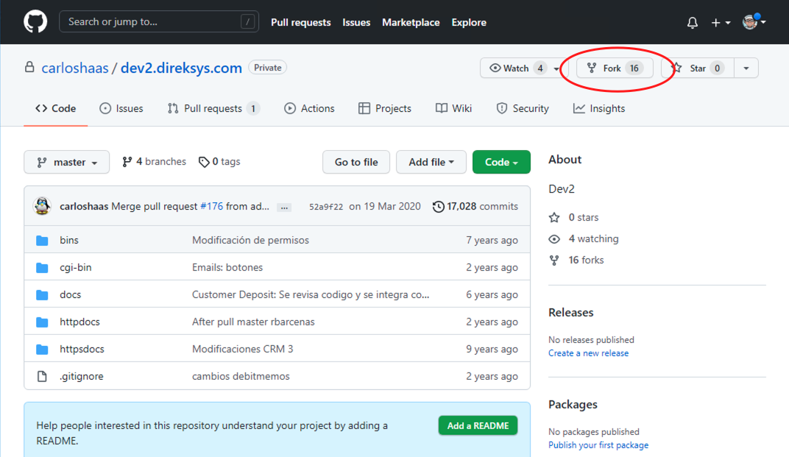
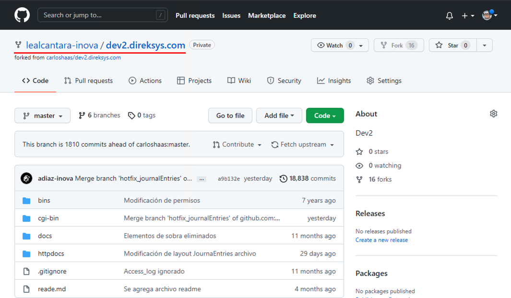
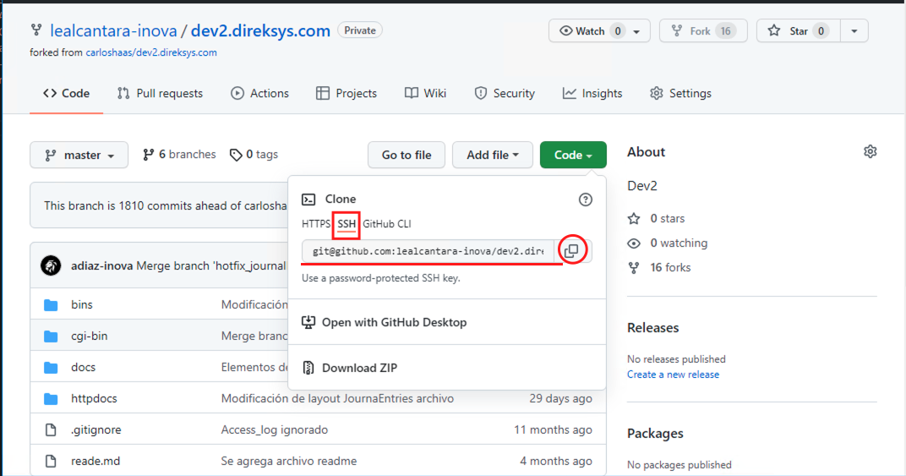
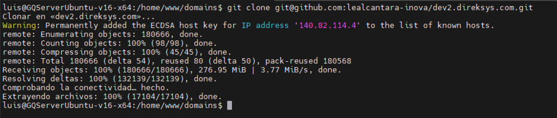

[< Regresar al Inicio](./README.md)

# Clonar Repositorio

Antes de clonar el repositorio debes generar tu **llave ssh (key ssh)** para este proceso se puede seguir los pasos publicados en la pagina de [github](https://docs.github.com/en/authentication/connecting-to-github-with-ssh/generating-a-new-ssh-key-and-adding-it-to-the-ssh-agent).

# Solicita acceso al repo dev2.direksys.com

Antes de continuar debes solicitar acceso al repo de dev2.direksys.com el cual esta en: https://github.com/carloshaas/dev2.direksys.com

# Hacer Fork

Una ves tienes acceso al repositorio mencionado lo que se tiene que hacer es un fork al proyecto que esta en: https://github.com/carloshaas/dev2.direksys.com



Esto hace que el proyecto se genere en tu cuenta de github:



Una ves que el proyecto esta generado en tu cuenta puedes dar clic en el boton verde que dice Code. Eso abrira un recuadro en el que tienes que seleccionar **SSH** y ahi puedes copiar el texto del cuadro que se ve.



Una vez copiado el texto en tu terminal primero dirigete a la ruta domains:

```cd /home/www/domains```

Ya estando ahi solo escribe: 

``git clone``

y seguido de un espacio pega el texto copiado, el comando debe quedar así:

``git clone git@github.com:lealcantara-inova/dev2.direksys.com.git``

Al dar enter iniciara la descarga del proyecto en tu maquina virtual.



[< Regresar al Inicio](./README.md)