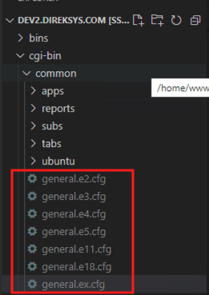
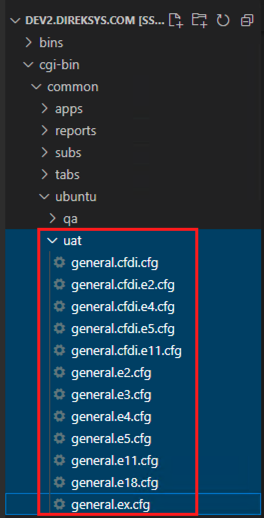
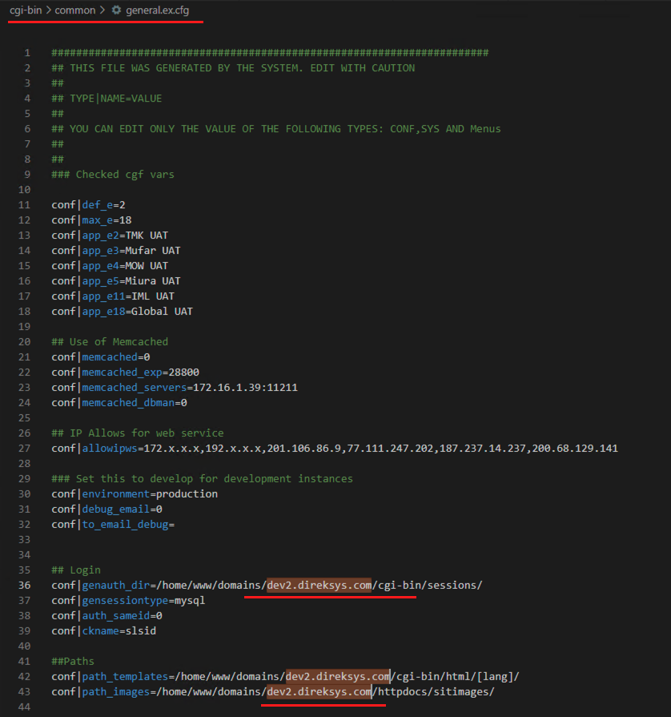
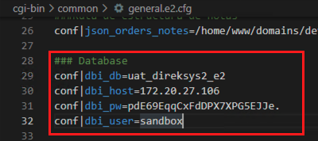

# Configuracion para levantar aplicativo

En este punto si accedes a tu navegador http://le.direksys.com/ debes ver un mensaje de error ya que el aplicativo esta fallando. Si por algun motivo no se ve el error o ves otra cosa hay que revisar los puntos:

1. [Clonar repositorio](./clonar-repositorio.md)
2. [Configurar virtual host en la maquina virtual`](configurar-virtual-host-maquina-virtual.md)
3. [Configurar host en tu maquina de windows](configurar-host-maquina-windows.md)

# Configuración

Dentro del proyecto dev2.direksys.com hay que entrar en la carpeta ``cgi-bin/common`` en esa carpeta hay que generar los archivos requeridos.

En la imagen se ven los archivos que se deben generar para hacer que el sistema funcione correctamente. Esos archivos no estan en tu carpeta la imagen solo es una referencia de como debe quedar.

Los archivos que se muestran arriba estan en la carpeta ``cgi-bin/common/ubuntu/uat`` solo hay que copiar cada uno y pasarlos a ``cgi-bin/common``

## Configurando archivo gneral.ex.cfg

En el archivo gneral.ex.cfg debes sustituir todas la lineas que contengan ``/home/www/domains/uat.direksys.com`` por ``/home/www/domains/dev2.direksys.com``.

tambien peudes solo sustituir todo ``uat.direksys.com`` por ``dev2.direksys.com``

En la imagen de abajo se muestra como se sustitulle el texto antes mencionado. 

Esto mismo se debe hacer en cada unos de los archivos que se ven en la imagen:

NOTA: Es importante que la copia de los archivos la hagas de la carpeta ``cgi-bin/common/ubuntu/uat`` y los paseas a ``cgi-bin/common``.

## Configurando conexiones a base de datos:

Esta configuracion se debe hacer para cada uno de las empresas y se realizan en cada uno de los archivos que se movieron. En este caso solo se muestra con el archivo ``general.e2.cfg`` pero esto tambien se debera realizar en cada uno de los archivos:

Antes de continuar solicita los acceos para que los puedas colocar, es posible que sean los mismos que se ven en la imagen pero pueden haber cambiado con el tiempo:

De esta forma ya puedes acceder al aplicativo web.