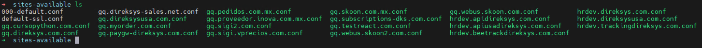

[< Regresar al Inicio](./index.md)

# Configurar Virtual host en la maquina virtual

Antes de continuar hay que recordar que todos los proyectos se deben colocar en la ruta siguiente ruta:

``/home/www/domains``

en este ejemplo se esta configurando el proyecto de **dev2.direksys.com** por lo que la ruta final es:

``/home/www/domains/dev2.direksys.com``

Ahora que eso esta claro hay que mencionar que el servidor cuenta con Apache como servidor web y que requiere el uso de host vitual si quieres ver mas a detalle el tema pudes seguir el siguiente link a [digitalocean](https://www.digitalocean.com/community/tutorials/how-to-set-up-apache-virtual-hosts-on-ubuntu-16-04).

## Limpiar carpeta sites-available

Antes de continuar recueda que estas en una maquina que ya cuenta con varias configuraciones por lo que primero limpiaremos todo para poder continuar:

Dirigete a la carpeta sites-available:

``cd /etc/apache2/sites-available``

Si haces un ls podras ver que seguramente hay muchos archivos en esta carpeta y que todos terminan con la extencion .conf



solo hay que eliminar todos los archivos dentro de esta carpeta con el siguiente comando:

``rm -r ./*.conf``

El comando pasado elimina todos los archivos que esten en la ruta actual y que terminen con la extenciosn ``.conf``

Si nuevamente ejecutas un ``ls`` ahora la carpeta estara limipa.


[< Regresar al Inicio](./index.md)


## Limpiar carpeta sites-enabled

Antes de continuar recueda que estas en una maquina que ya cuenta con varias configuraciones por lo que primero limpiaremos todo para poder continuar:

Dirigete a la carpeta sites-enabled:

``cd /etc/apache2/sites-enabled``

Si haces un ls podras ver que seguramente hay muchos archivos en esta carpeta y que todos terminan con la extencion .conf


solo hay que eliminar todos los archivos dentro de esta carpeta con el siguiente comando:

``rm -r ./*.conf``

El comando pasado elimina todos los archivos que esten en la ruta actual y que terminen con la extenciosn ``.conf``

Si nuevamente ejecutas un ``ls`` ahora la carpeta estara limipa.

## Crear virtualhost

Ahora que ya estan limpias las carpetas ``sites-available`` y ``site-enable`` nos dirigimos a sites-available:

``cd /etc/apache2/sites-available``

Dentro de esta carpeta hay que crear un archivo llamado: ``nombre.direksys.com.conf`` sustituye el ``nombre`` por tus iniciales por ejemplo ``luis`` seria ``ls.direksys.com.conf``

para crear el archivo puedes usar: ``touch ls.direksys.com.conf`` este comando solo crear el archivo.

Ahora debes editar el contenido de este archivo con el editor de tu gusto: ``vim`` o ``nano``. 

Agrega la siguiente informacion al archivo guarda y sal de tu editor.

```apache
<VirtualHost *:80>
   ServerName ls.direksys.com
   ServerAdmin  "postmaster@direksys.com"
   DocumentRoot /home/www/domains/dev2.direksys.com/httpdocs
   TransferLog  /home/www/domains/dev2.direksys.com/logs/direksys_access
   ErrorLog     /home/www/domains/dev2.direksys.com/logs/direksys_error
   LogFormat "%v \"%{Host}i\" %h %t \"%r\" %>s %b" dksys2
   AddHandler cgi-script .cgi

   ScriptAlias  /cgi-bin/ /home/www/domains/dev2.direksys.com/cgi-bin/
   php_admin_flag engine on
   <Directory /home/www/domains/dev2.direksys.com/httpdocs>
        #AllowOverride All
        Require all granted
        Options +Includes +ExecCGI -Indexes +FollowSymLinks
   </Directory>
</VirtualHost>
```

Si seguiste los pasos anteriore notaras que este archivo hace referencia a las carpetas que se crearon como por ejemplo ``/home/www/domains/`` o ``/home/www/domains/dev2.direksys.com``

Pero tambien estan estas 2 lineas:

```apache
TransferLog  /home/www/domains/dev2.direksys.com/logs/direksys_access
ErrorLog     /home/www/domains/dev2.direksys.com/logs/direksys_error
```
Si te diriges a esta ruta:

``cd /home/www/domains/dev2.direksys.com``
y ejecutas un ``ls`` notaras que no exite la carpeta ``logs`` lo que pasa es que el archivo le dice a apache que para este sistema los logs se guardaran en esa ruta por lo que es necesario crear solo la carpeta ``logs`` y apache se encargara de crear los archivos en el. Para crear la carpeta ejecuta:

``mkdi logs``

## Habilitacion de los nuevos archivos de host virtual

Dirigete de nuevo a la carpeta site ``sites-available``:

``cd /etc/apache2/sites-available``

y ahi ejecuta el comando ``a2ensite`` herramienta que se usa para habilitar cada uno de los sitios:

``sudo a2ensite ls.direksys.com.conf``

Renicia el serivcio de apache:

``sudo systemctl restart apache2``

Valida que el servuicio esta funcionando:

``sudo systemctl status apache2``

Si todo salio bien dentro de la carpeta ``cd /etc/apache2/sites-enabled`` se creo el link simbolico del archivo.

**NOTA: El sistema aun no es visible en este punto. Pero lo que se busca es que el ejecutar el ``sudo systemctl status apache2`` te diga que esta funcionando correctamente**.

[< Regresar al Inicio](./index.md)