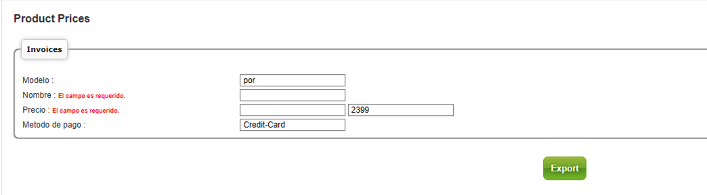

[< Regresar al Inicio](./README.md)

# Creando un reporte csv

Este apartado es continuación el tema:  **Crear nueva seccion en menu.** Antes de continuar primero hay que seguir ese apartado.

Primero vamos a editar el html agregando un formulario y adicional se colocaran variables de errores:

El archivo es este: **\home\www\domains\dev2.direksys.com\cgi-bin\html\en\common\report2022.html**

```html
[ip_header]

<script>
<!--
$(document).ready(function() {

	/*AJAX Error handler*/
	$(document).ajaxError(function(e, xhr, settings, exception) {
		alert('error in: ' + settings.url + ' \n'+'error:\n' + xhr.responseText );
	});


	var dates = $( "#from_date_cm, #to_date_cm" ).datepicker({
		dateFormat: 'yy-mm-dd',
		defaultDate: "-2m",
		minDate: new Date(2009,1-1,1),
		maxDate: new Date(),
		changeMonth: true,
		numberOfMonths: 3,
		onSelect: function( selectedDate ) {
			var option = this.id == "from_date_cm" ? "minDate" : "maxDate",
				instance = $( this ).data( "datepicker" ),
				date = $.datepicker.parseDate(
					instance.settings.dateFormat ||
					$.datepicker._defaults.dateFormat,
					selectedDate, instance.settings );
			dates.not( this ).datepicker( "option", option, date );
		}
	});

	var dates = $( "#from_date, #to_date" ).datepicker({
		dateFormat: 'yy-mm-dd',
		defaultDate: "-2m",
		minDate: new Date(2009,1-1,1),
		maxDate: new Date(),
		changeMonth: true,
		numberOfMonths: 3,
		onSelect: function( selectedDate ) {
			var option = this.id == "from_date" ? "minDate" : "maxDate",
				instance = $( this ).data( "datepicker" ),
				date = $.datepicker.parseDate(
					instance.settings.dateFormat ||
					$.datepicker._defaults.dateFormat,
					selectedDate, instance.settings );
			dates.not( this ).datepicker( "option", option, date );
		}
	});

	var sales_dates = $( "#from_doc_date, #to_doc_date" ).datepicker({
		dateFormat: 'yy-mm-dd',
		defaultDate: "-2m",
		minDate: new Date(2009,1-1,1),
		maxDate: new Date(),
		changeMonth: true,
		numberOfMonths: 3,
		onSelect: function( selectedDate ) {
			var option = this.id == "from_doc_date" ? "minDate" : "maxDate",
				instance = $( this ).data( "datepicker" ),
				date = $.datepicker.parseDate(
					instance.settings.dateFormat ||
					$.datepicker._defaults.dateFormat,
					selectedDate, instance.settings );
			sales_dates.not( this ).datepicker( "option", option, date );
		}
	});


});
-->
</script>

<table border="0" cellspacing="1" cellpadding="0" width="[ur_table_width]" bgcolor="#dedede">
	<tr>
		<td bgcolor="#ffffff" width=200px valign=top align=center>
    		<!-- Acordion inicia-->
			<table cellpadding=0 cellspacing=5 border=0><td align=left>
			<font face=verdana>
			<ul id="accordion">
				[fc_build_menu]
			</ul>
			<script type="text/javascript" src="[va_yui_url]build/accordionview/accordionview-min.js"></script>
			<script type="text/javascript">
				var mainmenu = new YAHOO.widget.AccordionView('accordion', {collapsible: true, animationSpeed: '0.4', expandItem:[fc_template_reportsmenu], width: '180px', animate: true, effect: YAHOO.util.Easing.easeNone});
			</script>
		</td>
		</table>
		<td valign="top" aling="left" bgcolor="#ffffff">
<!-- Start Main Area  -->
	<table width="100%" border="0" cellspacing="0" cellpadding="0" class="tab" align="center">
	  <tr>
	    <td width="70%" align="center"></td>
	    <td width="30%" class='cell_on' align='center' onClick='trjump("/cgi-bin/mod/[ur_application]/admin?cmd=[in_cmd]")'>Product Prices</td>
	  </tr>
	</table>

	<div style="background-color:#ffffff;margin:15px;">
		


  <form action="/cgi-bin/mod/[ur_application]/admin" method="post" name="sitform">
	<input type="hidden" name="cmd" value="[in_cmd]">
	<input type="hidden" name="action" value="1">

	<table border="0" cellspacing="0" cellpadding="2" width="100%">
		<tr>
			<td class="titletext" align="center">Product Prices</td>
		</tr>
		<tr>
			<td class="stdtxterr">[va_message]</td>
		</tr>
	</table>
	&nbsp;
	<fieldset><legend>Invoices</legend>
		<h1>[va_permiso_nuevo]</h1>
		<table border="0" cellspacing="0" cellpadding="2" width="100%">	
			<tr>
			    <td width="20%">Modelo : <span class="smallfieldterr">[er_model]</span></td>
			    <td class="smalltext">
			    	<input type="text" id="model" name="model" value="[in_model]" class="input">
		    	</td>
			</tr>
			<tr>
				<td width="20%">Nombre : <span class="smallfieldterr">[er_name]</span></td>
			    <td class="smalltext">
			    	<input type="text" id="name" name="name" value="[in_name]" class="input">
		    	</td>
			</tr>
			<tr>
				<td width="20%">Precio : <span class="smallfieldterr">[er_price_min]</span></td>
			    <td class="smalltext">
			    	<input type="text" id="price_min" name="price_min" value="[in_price_min]" class="input">
					<input type="text" id="price_max" name="price_max" value="[in_price_max]" class="input">
		    	</td>
			</tr>
			<tr>
				<td width="20%">Metodo de pago : <span class="smallfieldterr">[er_paytype]</span></td>
			    <td class="smalltext">
			    	<input type="text" id="paytype" name="paytype" value="[in_paytype]" class="input">
			    </td>
			</tr>			
		</table>
	</fieldset>
	&nbsp;

	<p align="center"><input type="submit" value="Export" class="button" loading="0"></p>
  </form>

<script type="text/javascript">
<!--
	chg_radio('ptype','[in_ptype]');
	chg_radio('invoice_type','[in_invoice_type]');
	chg_radio('id_salesorigins','[in_id_salesorigins]');
	chg_radio('type','[in_type]');
	chg_radio('currency','[in_currency]');
-->
</script>

<!-- End Main Area  -->
		</td>
	</tr>
</table>

[ip_footer]
```


En el código mostrado es importante ver las siguientes lineas:

**[ur_application]** variable global para tener la ruta del sistema en este caso como se esta creando un admin al final se coloca admin

Adicional va un **input hidden** llamado action este se usara en el back para validar si hay una petición post

```html
<form action="/cgi-bin/mod/[ur_application]/admin" method="post" name="sitform">
	<input type="hidden" name="cmd" value="[in_cmd]">
	<input type="hidden" name="action" value="1">
```

Tambien se agregan los inputs que van a ser enviados y validados 

```html
<tr>
    <td width="20%">Modelo : <span class="smallfieldterr">[er_model]</span></td>
    <td class="smalltext">
        <input type="text" id="model" name="model" value="[in_model]" class="input">
    </td>
</tr>
```

**[er_model]** que es una variable que solo se vera si retornamos un error en el back

**[in_model]** Es la información que el usuario escribe pero el name y id va sin corchetes y sin: **in**

Del lado del back en el archivo

**\home\www\domains\dev2.direksys.com\cgi-bin\mod\admin\admin.html.cgi**  

editamos el metodo que ya teniamos **report2022**

```perl
sub report2022 {
# --------------------------------------------------------
# Created :  Carlos Haas 01/01/2007 6:47:28 PM
# Last Update :
# Locked by :
# Description :
#
#
	# &cgierr("Unable to open directory", $query);
	# creamos variable de error
	my $err = 0;
	# Los formularios deben traer un input con el action = 1
	# si existe esto quieredecir que es una solicitud de formulario
	if ($in{'action'}){
		# Validamos el campo model 
		if (!$in{'model'}){
			$error{'model'} = trans_txt('required');
			$err++;
		}
		# Validamos el campo name
		if (!$in{'name'}){
			$error{'name'} = trans_txt('required');
			$err++;
		}
		# Validamos el campo paytype
		if (!$in{'paytype'}){
			$error{'paytype'} = trans_txt('required');
			$err++;
		}
		# Validamos el campo price_min 
		if (!$in{'price_min'}){
			$error{'price_min'} = trans_txt('required');
			$err++;
		}
		# Si no existe errores
		if (!$err){
			## definimos el nombre del csv
			my $fname   = 'Rep_Direksys2022.csv';
			$fname =~ s/\s/_/g;
			print "Content-type: application/octetstream\n";
			print "Content-disposition: attachment; filename=$fname\n\n";
			my $record = qq|ID_products,Model,Name,Status,Price,PayType,status_2,ID_admin_users,usuario,Email,Date,Time\r\n|;
			print $record;
			# creamos la consulta
			my $query = qq|
				SELECT 
				sl_products.ID_products,
				sl_products.Model,
				sl_products.Name,
				sl_products.Status,
				sl_products_prices.Price,
				sl_products_prices.PayType,
				sl_products_prices.status as 'status 2',
				sl_products.ID_admin_users,
				CONCAT(admin_users.FirstName, " " ,admin_users.LastName ) as 'usuario',  
				admin_users.Email,
				sl_products.`Date`,
				sl_products.Time
				from sl_products
				join sl_products_prices
					on sl_products_prices.ID_products = sl_products.ID_products 
				JOIN  admin_users
					on admin_users.ID_admin_users = sl_products.ID_admin_users
				WHERE 
					sl_products.Status = 'On-Air' AND 
					sl_products.Model like '%$in{'model'}%' AND 
					sl_products.Name like '%$in{'name'}%' AND
					sl_products_prices.PayType = '$in{'paytype'}' AND
					sl_products_prices.Price BETWEEN $in{'price_min'} and $in{'price_max'}|;
			# Ejecutamos la consulta
			my $consulta = &Do_SQL($query);
			# Recorremos las filas de la consulta
			while (my ($ID_products,$Model,$Name,$Status,$Price,$PayType,$status_2,$ID_admin_users,$usuario,$Email,$Date,$Time) = $consulta->fetchrow()){				
				# Escribimos el body del csv
				$record = qq|$ID_products,$Model,$Name,$Status,$Price,$PayType,$status_2,$ID_admin_users,$usuario,$Email,$Date,$Time\r\n|;
				print $record;
			}
			return;
		}

		
	}
	# Retornamos la vista del html
	print "Content-type: text/html\n\n";
	print build_page('report2022.html');
}
```
Este código debe generar un csv de lo que se consulto y se descarga en automatico ademas de generar la validación: 



[< Regresar al Inicio](./README.md)