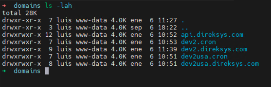

[< Regresar al Inicio](./README.md)

# Crear carpeta de domains

La carpeta domains es donde se podran almacenar todos los proyectos que queramos. Esta carpeta se genera en una ruta especifica ya que es lo mas parecido a producctivo. Y antes de clonar cualquier proyecto es importante que este vacia para asi no confundirte.

La carpeta domains ya existe en la maquina virtual y puedes acceder a ella ejecutando:

``cd /home/www/domains``

**NOTA: Si por algun motivo el comando pasado te arrojo un error puedes crear la carpeta con el siguiente comando:**

``mkdir /home/www/domains`` seguido de un ``cd /home/www/domains`` para acceder a la carpeta.

Si la carpeta exisitia es posible que tenga archivos para validar si existen archivos ejecuta un:

``ls -lah``

Este comando listara los archivos que hay dentro de la carpeta



Si existen archivos dentro de la carpeta lo que se tiene que hacer es eliminar los uno por uno por ejemplo:

```bash
rm -r api.direksys.com
rm -r dev2.direksys.com
rm -r dev2.cron
```

[< Regresar al Inicio](./README.md)