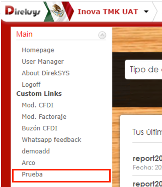
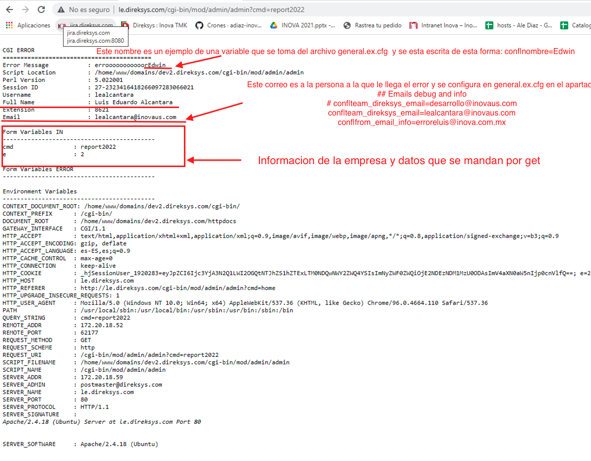
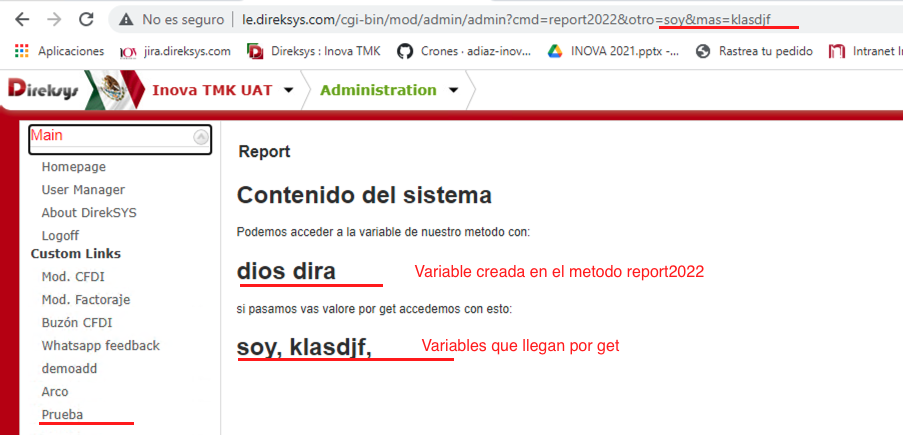

[< Regresar al Inicio](./README.md)

# Crear nueva seccion en menu

Los menus se agregan en base de datos en la tabla sl_menus y esto se hace en cada empresa.

En este ejemplo lo agregamos en la empresa e2 por lo tanto se hace uso de la base de datos: uat_direksys2_e2:

Consulta para los menus:

```sql
SELECT * from sl_menus;
```

Este es el query que se usa para insertar el menu de ejemplo:

```sql
INSERT INTO sl_menus 
(`Level`,Label,icon,Link,Application,command,IsTitle,ID_parent,Sort,Status,`Date`,`Time`,ID_admin_users,IsDbman,isReport) 
VALUES 
(2,'Logoff','','/cgi-bin/mod/admin/admin?cmd=report2022','admin',NULL,'No',38,4,'Active','2019-06-10','14:05:48',7835,0,0);
```

Si se accede al sitio dentro de la empresa TML UAT veremos el menu:



Hay que tomar en cuenta que en el apartado de link en el query se agrego lo siguiente
/cgi-bin/mod/admin/admin?cmd=report2022 que hace referencia al link y metodo que mandara a llamar el sistema.

## Visualizar sección con mensaje de error:

Para que esta sección funcione nos tenemos que ir al archivo \home\www\domains\dev2.direksys.com\cgi-bin\mod\admin\admin.html.cgi y ahi crear el metodo report2022 con informacion relevante, al final del documento y siempre antes el }1; se debe agregar:

```perl
sub report2022 {
# --------------------------------------------------------
# Created :  Carlos Haas 01/01/2007 6:47:28 PM
# Last Update :
# Locked by :
# Description :
#
#
    ## mandar a llamar errores
    &cgierr("errooooooooooor".$cfg{'nombre'});
}
```

Este código manda a llamar una vista de error en el sistema:



Los apartados que se comentan en la imagen fueron modificados en: **\home\www\domains\dev2.direksys.com\cgi-bin\common\general.ex.cfg** y corresponde a las siguientes lineas:


```perl
# Correo al que se manda el bug
conf|team_direksys_email=lealcantara@inovaus.com
# correo que manda el bug
conf|from_email_info=erroresluis@inova.com.mx
```

Tambien se pueden agregar mas variables por ejemplo:

```perl
conf|raw_cgierr=1
conf|app_title=00000000000000000000
conf|nombre=Luis Eduardo
```

Pero como se ve en la imagen ahi dice Edwin y no Luis Eduardo

Esto es por que en el archivo de configuración de **general.e2.cfg** se agrego la siguiente linea

**conf|nombre=Edwin**

Como la prueba se esta realizando en la empresa **e2** y en ese archivo esta esa variable ignorara la variable de **general.ex.cfg** y tomara en cuenta la variable que esta en la empresa **general.e2.cfg**.


## Visualizar sección con sitio web

Dentro del archivo **\home\www\domains\dev2.direksys.com\cgi-bin\mod\admin\admin.html.cgi** en el metodo **report2022** editamos el contenido comentando el **cgierr** y creamos una variable y por ultimo la pasamos a la vista del un html ya existente:

El código queda de la siguiente forma:

```perl
##################################################################
	#      CUSTOM PAGES       	#
	##################################################################
	sub report2022 {
	# --------------------------------------------------------
	# Created :  Carlos Haas 01/01/2007 6:47:28 PM
	# Last Update : 
	# Locked by : 
	# Description :
	#
	#
		## mandar a llamar errores
		# &cgierr("errooooooooooor".$cfg{'nombre'});
		$va{'valor'}="dios dira";
		print "Content-type: text/html\n\n";
		print build_page('report2022.html');
	}
```

El archivo html esta en la siguiente ruta: \home\www\domains\dev2.direksys.com\cgi-bin\html\en\common\report2022.html

```html
[ip_header]
<table border="0" cellspacing="1" cellpadding="0" width="[ur_table_width]" bgcolor="#dedede">
	<tr>
		<td bgcolor="#ffffff" width=200px valign=top align=center>
    		<!-- Acordion inicia-->
			<table cellpadding=0 cellspacing=5 border=0>
				<td align=left>
					<font face=verdana>
								<ul id="accordion">
						[fc_build_menu]
					</ul>
					</font>
					<script type="text/javascript" src="[va_yui_url]build/accordionview/accordionview-min.js"></script>
					<script type="text/javascript">
						var mainmenu = new YAHOO.widget.AccordionView('accordion', {collapsible: true, animationSpeed: '0.4', expandItem: 8, width: '180px', animate: true, effect: YAHOO.util.Easing.easeNone});
					</script>
				</td>
			</table>
		</td>
		<td valign="top" aling="left" bgcolor="#ffffff">
		<!-- Start Main Area  -->

			<div style="background-color:#ffffff;margin:15px;">
				<table border="0" cellspacing="0" cellpadding="2" width="100%">
					<tr>
					    <td style="float: right;padding-right: 100px;background-color: #fff; font-size:medium;color: green;font-weight: bold;">[va_message]</td>
					</tr>
					<tr>
					    <td class="titletext" align="left" colspan="2">Report</td>
					</tr>
			    </table>
				<h1>Contenido del sistema</h1>	
				<p>
					Podemos acceder a la variable de nuestro metodo con:
				</p>		
				<h1>
					[va_valor]
				</h1>
				<p>
					si pasamos vas valore por get accedemos con esto:
				</p>
				<h1>
					[in_otro],
					[in_mas],
				</h1>
				&nbsp;
			</div>
		<!-- End Main Area  -->
		</td>
	</tr>
</table> 
<script>
<!--
$(document).ready(function() {

	var dates = $( "#from_date, #to_date" ).datepicker({
		dateFormat: 'yy-mm-dd',
		defaultDate: "-2m",
		minDate: new Date(2009,1-1,1),
		maxDate: new Date(),
		changeMonth: true,
		numberOfMonths: 3,
		onSelect: function( selectedDate ) {
			var option = this.id == "from_date" ? "minDate" : "maxDate",
				instance = $( this ).data( "datepicker" ),
				date = $.datepicker.parseDate(
					instance.settings.dateFormat ||
					$.datepicker._defaults.dateFormat,
					selectedDate, instance.settings );
			dates.not( this ).datepicker( "option", option, date );
		}
	});

});
-->
</script>
[ip_footer]
```

Para este ejemplo accedemos a la misma ruta creada pero en la url agregamos: &otro=soy&mas=klasdjf



[< Regresar al Inicio](./README.md)