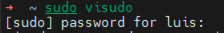

[< Regresar al Inicio](./README.md)

# Crear usuario

Por defencto la maquina virtual tiene un usuario esto dependera de quien te pase la imagen, pide que te den el usuario y contraseña del mismo para poder seguir adelante.

Antes de Iniciar tienes que descargar un programa que te permita acceder por **ssh** se recomienda el uso se [Putty](https://www.putty.org/) o [MobaXterm](https://mobaxterm.mobatek.net/download-home-edition.html).

Antes de continuar puedes necesitar hacer los siguientes pasos:

1. [Saber ip de la maquina virtual](./saber-ip-maquina-virtual.md)
2. [Acceder por SSH (Ejemplo con MobaXterm)](./acceder-por-ssh.md)

## Crear Usuario

Para crear tu usuario puedes copiar y pegar este comando solo sustitulle **nombreDelUsuario** por tu **nombre**:
```bash
sudo useradd -d /home/nombreDelUsuario -m -s /bin/bash nombreDelUsuario`
```

El comando pasado hace el uso de banderas las cueales se explican acontinuacion:
1. ``-d /home/nombreDelUsuario -m``: Este fracmento del comando crea el directorio del usuario que se va crear.
2. ``-s /bin/bash nombreDelUsuario``: Este fragmento del comando hace que el usuario use por defecto el bash para poder trabajar en la terminal.

## Asignar contraseña al usuario:

Para asignar contraseña solo ejecuta:

``sudo passwd nombreDelUsuario``

Este comando te pedira la contraseña para el usuario y despues te pedira confirmarla.

## Agregar usuario a Sudores

Este punto es para que tu usuario tenga privilegios de administrador. En la terminal ejecuta: ``visudo`` este comando te pedira la contrasea y debes poner la que te proporcionaron.



El comando ``visudo`` te abre el siguiente archivo y solo tienes que agregar a tu usuario en la linea de abajo como se ve en la imagen.

Para cerrar el editor tienes que oprimier Ctrl+o despues oprimes enter y al final solo oprimer Ctrl+x


En este punto ya cuenta con el usuario nuevo pero sigues logueado con el usuario que tenia la maquina virtual por lo que solo cierra tu pestaña en moba o en putty y ahora puedes acceder por ssh con tu nuevo usuario:

1. [Acceder por SSH (Ejemplo con MobaXterm)](./acceder-por-ssh.md)


[< Regresar al Inicio](./README.md)