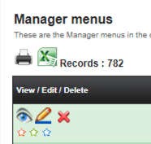
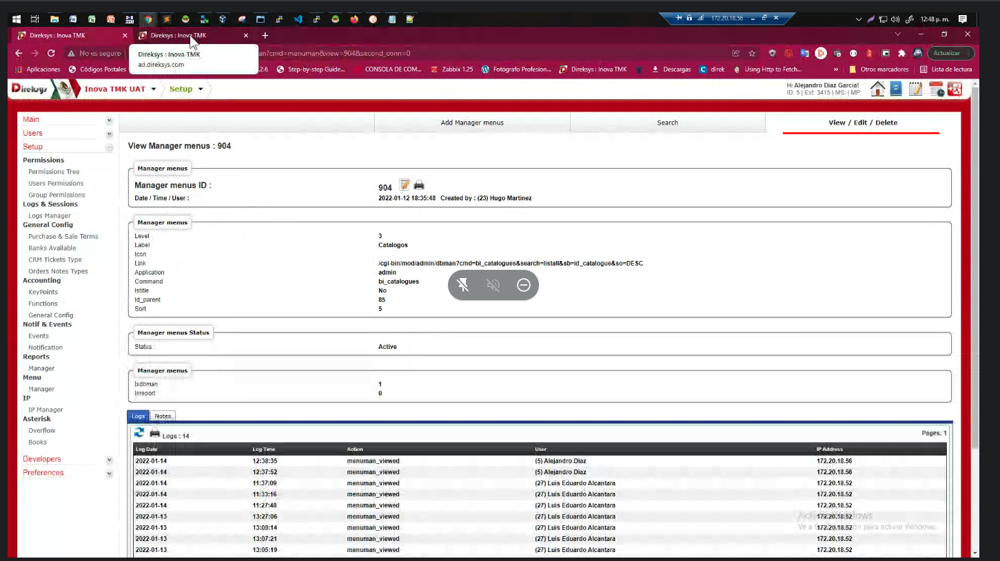
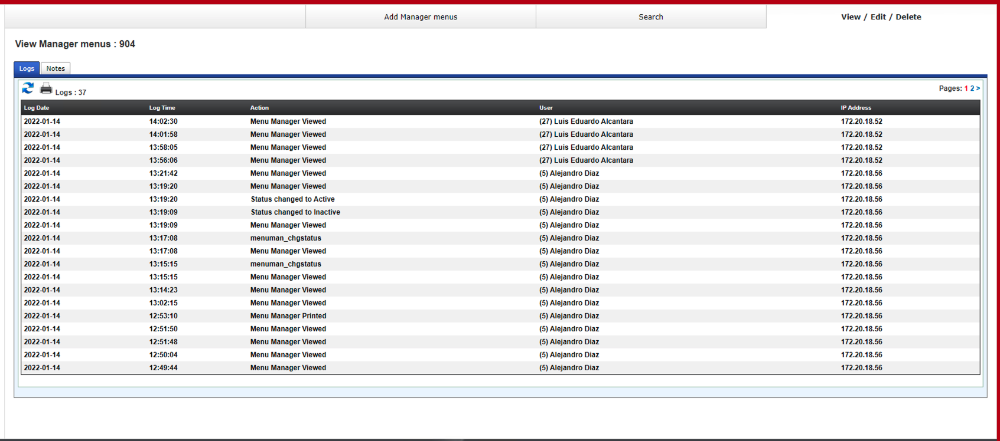
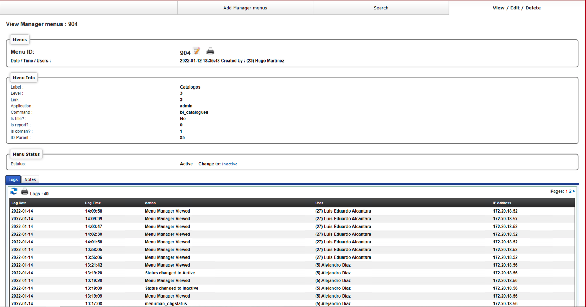

[< Regresar al Inicio](./README.md)

# Crear tu propia vista (icono del ojo)

El dbman crea su propio crud pero podemos editar y mejorar funcionalidades en este caso nos dirigimos al ojo que vemos



Al acceder al ojo veremos lo siguiente:



Esta vista es la que esta por defecto pero nosotros la modificaremos creando un archivo nuevo llamado menus_view.html este nombre se saca por 2 cosas

1. menus → viene el archivo setup.ex.cfg en la variable siguiente: 
```perl
sys|db_menuman_form=menus
```
2. view → por que queremos generar la vista que pertenece al apartado view.

El archivo se tiene que generar en la siguiente ruta: 

\home\www\domains\dev2.direksys.com\cgi-bin\html\en\forms\menus_view.html

Si agregamos un html vacío lo que se vera es lo siguiente:



Como se puede ver la información desaparece por lo que el codigo que se colocara es el siguiete:


```perl
<fieldset><legend>Menus </legend>
		<table width="100%" cellspacing="0" cellpadding="2" border="0">
			<tbody><tr>
		  	<td width="30%" class="titletext">Menu ID:</td>
		    <td class="titletext">
				<div class="scroller_anchormenu"></div> 
					<div class="scrollermenu">
						<div class="top_icons">
							[in_view]
					    	<a href="/cgi-bin/mod/[ur_application]/dbman?cmd=[in_cmd]&amp;modify=[in_view]"></a> &nbsp;
							<a href="javascript:prnwin('/cgi-bin/mod/[ur_application]/dbman?cmd=[in_cmd]&amp;search=Print&amp;toprint=[in_view]')"></a> &nbsp;
						</div>
					</div>
				

			</td>
		 </tr>
		 <tr>
			<td width="30%" class="smalltext">Date / Time / Users  : </td>
			<td class="smalltext">[in_date] [in_time] Created by : ([in_id_admin_users]) [in_admin_users.firstname] [in_admin_users.lastname]</td>
		</tr>		
		</tbody></table>
</fieldset>
<br>
<fieldset><legend>Menu Info</legend>
	<table border="0" cellspacing="0" cellpadding="2" width="100%">
		<tr>
			<td width="30%">Label :  <span class="smallfieldterr"></span></td>
			<td class="smalltext">
				<span  id="spnIdAccounting">[in_label]</span>
			</td>
		</tr>
		<tr>
			<td width="30%">Level :  </td>
			<td class="smalltext">[in_level]</td>
		</tr>
				<tr>
			<td width="30%">Link :  <span class="smallfieldterr"></span></td>
			<td class="smalltext"><span id="spnParent">[in_link]</div></td>
		</tr>
		<tr>
			<td width="30%">Application :  <span class="smallfieldterr"></span></td>
			<td class="smalltext">[in_application]</td>
		</tr>
		<tr>
			<td width="30%">Command :  <span class="smallfieldterr"></span></td>
			<td class="smalltext">[in_command]</td>
		</tr>
		<tr>
			<td width="30%">Is title? :  <span class="smallfieldterr"></span></td>
			<td class="smalltext">[in_istitle]</td>	
		</tr>
		<tr>
			<td width="30%">Is report? :  <span class="smallfieldterr"></span></td>
			<td class="smalltext">[va_isreport]</td>	
		</tr>
		<tr>
			<td width="30%">Is dbman? :  <span class="smallfieldterr"></span></td>
			<td class="smalltext">[va_isdbman]</td>	
		</tr>
		<tr>
			<td width="30%">ID Parent :  <span class="smallfieldterr"></span></td>
			<td class="smalltext">[in_Id_parent]</td>
		</tr>
	</table>
</fieldset>
<br>
<fieldset><legend>Menu Status</legend>
		<table border="0" cellspacing="0" cellpadding="2" width="100%">
		 	<tr>
				<td valign="top" width="30%" valign="top">Estatus: </td> 
				<td class="smalltext" valign="top">[in_status]
					&nbsp;&nbsp;&nbsp; 
					<span class='smalltext'>Change to:</span>
					[va_chgstatus]
				</td>
			</tr>
  		</table>
	</fieldset>
```

En este cigo se deben editar las variables que se usan en base de datos por ejemplo:

1. [in_label]
2. [in_level]
3. [in_command]
4. ect

Todas esas variables son de la base de datos y se usan para mostrar el valor requerido

También se hace uso de la **[in_view]** que hace referencia al id del registro al que ce accede

Con esto la vista que se logra es la siguiente:



Pero como vemos en la imagen el valor de is report? y is dbman? solo es un valor 0 o 1 cuando debería decir yes o no esto lo controlaremos editando un archivo.

Editamos el siguiente archivo: 

\home\www\domains\dev2.direksys.com\cgi-bin\mod\setup\dbman.html.cgi

Donde agregaremos el siguiente codigo:  y en el podemos cambiar los valores que queramos asi como generar nueva funcinalidades

```perl
sub view_menuman{
	$va{'isdbman'} = ($in{'isdbman'} == 1)? 'Yes':'No';
	$va{'isreport'} = ($in{'isreport'} == 1)? 'Yes':'No';

	## Ejecuta Cambio de Status
	if ($in{'chgstatusto'} and &check_permissions('menuman_chgstatus','','')){
		my ($sth)	= &Do_SQL("UPDATE sl_menus SET Status='".&filter_values($in{'chgstatusto'})."' WHERE ID_menus='$in{'id_menus'}' LIMIT 1;");
		&auth_logging('menuman_chgstatus_'.lc($in{'chgstatusto'}),$in{'id_menus'});
		$in{'status'} = $in{'chgstatusto'};
	}

	## Genera Links de Cambio de Status
	if (!&check_permissions('menuman_chgstatus','','')){
		$va{'chgstatus'} = qq| <span class="smallfieldterr">|.&trans_txt('unauth_action').qq|</span>|;
	}else{
		my (@ary) = &load_enum_toarray('sl_menus','Status');
		for (0..$#ary){
			if ($ary[$_] ne $in{'status'}){
				$va{'chgstatus'} .= qq| <a href="/cgi-bin/mod/$usr{'application'}/dbman?cmd=[in_cmd]&view=$in{'view'}&chgstatusto=$ary[$_]">$ary[$_]</a> &nbsp;&nbsp;&nbsp;|;
			}
		}
	}


	# &cgierr('asdasdasdasdasd');

}
```

Por ultimo agregamos traducciones: en el archivo:

\home\www\domains\dev2.direksys.com\cgi-bin\html\en\mod\setup\messages.txt

```perl
###Menus
menuman_chgstatus_inactive=Status changed to Inactive
menuman_chgstatus_active=Status changed to Active
menuman_viewed=Menu Manager Viewed
menuman_printed=Menu Manager Printed
```

[< Regresar al Inicio](./README.md)