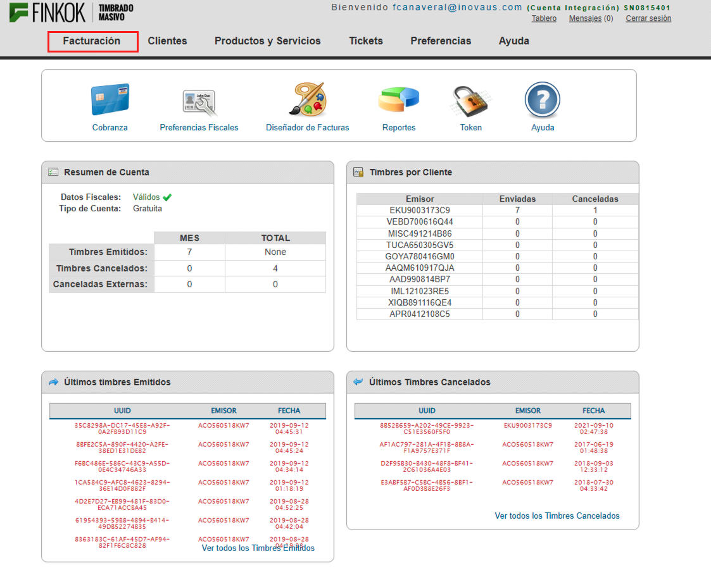
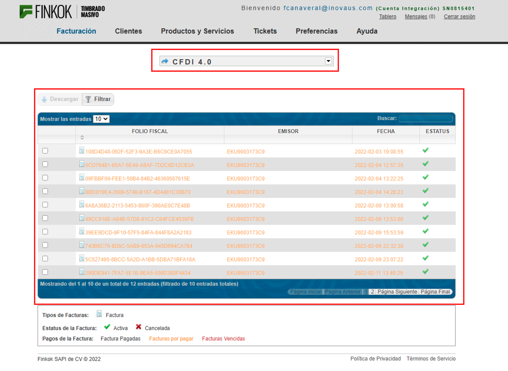

[< Regresar al Inicio](../index.md)

# Cron para timbrar invoice con status New
 
## Introducción.
 
Para este proceso se debe tener en cuenta los siguientes repositorios:
 
1. dev2.cron (Repositorio de crones)
2. dev2direksys.com (Repositorio de direksys)
 
También se debe tomar en cuenta que el timbrado de facturas se realiza por medio de finkok. Dentro del proyecto se hacen pruebas en el demo de finkok para esto puedes usar los siguientes accesos para el demo de finkok

* Link de acceso: [https://demo-facturacion.finkok.com/](https://demo-facturacion.finkok.com/)
* Usuario. fcanaveral@inovaus.com
* Contraseña: P4$$w0rd2020


 
Al acceder se debe ver lo siguiente, pero daremos click en el link de **Facturación**:
 

 
Al acceder nos muestra las facturas de la versión 3.3 pero en este caso nos interesa la versión 4.0 así que daremos click en el select y seleccionaremos la que dice **CFDI 4.0**:
 

 
Al acceder ya veremos las facturas timbradas con la versión 4.0
 

 
Adicional a esto debes ver primero el siguiente link: [https://github.com/adiaz-inova/dev2.direksys.com/wiki/Crones](https://github.com/adiaz-inova/dev2.direksys.com/wiki/Crones)


# Cron para timbrar finkok
 
``NOTA: Los siguientes puntos hablan de consultar la base de datos productiva, en este caso solo se muestra el productivo para validar si el cron está en status Active. Una vez que se compruebe se debe hacer todo en la base de UAT.``
 
Para saber qué cron ejecuta el timbrado por medio de cron nos dirigimos a la base productiva de ``direksys2_e2`` en al ``172.20.27.101`` ya estando ahi podemos ejecutar la siguiente consulta:

```sql
SELECT 
	ID_admin_events, 
	Name, 
	Description, 
	ActionType, 
	RunAction, 
	EmailNotification, 
	Status 
FROM admin_events 
WHERE RunAction = 'invoice_sing';
```

El resultado de esta consulta es el siguiente:
 

 
En la imagen vemos en la descripción que se encarga de timbrar las órdenes que están en status NEW adicional vemos que el campo status es ``Active`` lo que significa que esté cron está funcionando actualmente.
En el campo ``RunAction`` vemos el método que ejecuta el cron y es importante en este caso saber que el método es: ``invoice_sing``.
 
Es importante tomar en cuenta que el campo ``ID_admin_events`` es igual a ``102`` es importante ya que más adelante se usara.
 
Por último vemos el campo ``EmailNotification`` en este caso el valor es ``null`` pero en caso de que ese valor tenga un correo es importante cambiarlo al que se quiera que llegue la notificación. Ese cambio solo se debe hacer el uat no debes cambiar este campo en productivo.

## Logs de eventos de crones
 
Para este caso debemos hacer una consulta a la tabla ``admin_events_logs`` la cual registra el status del cron.
 
como se comentó arriba el cron que queremos revisar usa el id 102 por lo que haremos la siguiente consulta:
 
```sql
SELECT
   *
FROM admin_events_logs
WHERE ID_admin_events = 102 order by  ID_admin_events_logs ;
```
En la siguiente imagen vemos el número ``102``en el campo ``ID_admin_events`` también podemos ver el id del evento como ``ID_admin_events_logs``, también vemos el status del evento.
 
Es importante apuntar un ``ID_admin_events_logs`` ya que lo usaremos más adelante.
 


# Que codigo se ejecuta en dev2.cron
 
Como vimos el evento que se ejecuta es ``invoice_sing`` por lo que debemos ir al proyecto de dev2.cron y buscar en qué parte del código se hace uso de este evento.
 
Como podemos ver en la imagen el evento ``invoice_sing`` se usa en varios archivos. En este caso abriremos el que dice:
 
``sub event_act_e2_invoice_sing {``
 
Este archivo esta en la siguiente ruta: ``dev2.cron\bins\libs\e2\fn_low.pl``
 
 

 
Al abrir veremos el siguiente código:

```perl
sub event_act_e2_invoice_sing {
#############################################################################
############################################################################# 

    my $ua = new LWP::UserAgent;
    my $response = $ua->get('http://172.16.1.39/finkok/Facturas/?action=cron&e=2', Cookie => $cfg{'cookie_for_get_pdf'});
    my $msg = $response->content;
    print $msg;
    $msg="OK->Timbrado automatico de e2.";
    return $msg;

}
```

Se debe cambiar la ip ``172.16.1.39`` ya que al parecer es una ip productiva. En mi caso quedaría de la siguiente forma:

```perl
sub event_act_e2_invoice_sing {
#############################################################################
############################################################################# 

    my $ua = new LWP::UserAgent;
    my $response = $ua->get('http://le.direksys.com/finkok/Facturas/?action=cron&e=2', Cookie => $cfg{'cookie_for_get_pdf'});
    my $msg = $response->content;
    print $msg;
    $msg="OK->Timbrado automatico de e2.";
    return $msg;

}
```

Para que este cambio funcione debes editar tu host de la máquina virtual:
 
```bash
sudo vim /etc/hosts
```
Se debe agregar lo siguiente (Cambia la ip por la de tu máquina y el dominio de tu proyecto).
 
``171.20.18.59    le.direksys.com``
 
Ahora como se ve en el código solo es una petición get a la ruta:
 
``http://le.direksys.com/finkok/Facturas/?action=cron&e=2``
 
Y le pasa 2 parametros por get:
 
* action = cron
* e = 2
 
Esta peticion llega al proyecto ``dev2.direksys.com``

# Qué código se ejecuta en dev2.direksys.com
 
Los archivos que se deben tener en cuenta son:
 
1. dev2.direksys.com\cgi-bin\common\general.ex.cfg
2. dev2.direksys.com\httpdocs\finkok\Facturas\index.php
3. dev2.direksys.com\httpdocs\finkok\Facturas\index_console.php


## Archivo general.ex.cfg
 
De este archivo lo único que debemos tener en cuenta es la línea ``cfdi_version``, que es la que se usa para definir el tipo de factura que se va a timbrar.
 
``conf|cfdi_version=3.3``
 
En el caso de querer timbrar en la nueva versión se deberá cambiar a:
 
``conf|cfdi_version=4.0``


## Archivo index.php
 
A este archivo llega la petición que vimos en el código del cron hay que recordar que la petición llega como get pasando 2 parámetros:
 
``http://le.direksys.com/finkok/Facturas/?action=cron&e=2``
 
1. action = cron
2. e = 2
 
En el archivo ``index.php`` vemos un ``switch`` que revisa el ``action`` que llega y por lo tanto el case que buscamos es el que dicen ``cron``:
 
El código que nos interesa de este archivo es:

```php
case 'cron':
		system('php index_console.php --e='.EMPRESA.' --type=all --confirm=yes --status=New >> /dev/null 2>&1 &');
		echo 'php index_console.php --e='.EMPRESA.' --type=all --confirm=yes --status=New >> /dev/null 2>&1 &';
		// header('Content-Type: application/json');
		// echo json_encode(array('code'=>200));
		break;
```

Este código lo único que hace es ejecutar el archivo index_console.php pasando variables que el mismo archivo usa.

## Archivo index_console.php
 
Este archivo se ejecuta por el archivo index.php por medio del comando ``system()`` . Este archivo es medianamente grande y se puede revisar a detalle entrando a revisar su contenido.
 
Pero es importante tomar en cuenta que en el archivo ``index.php`` se pasa el parámetro ``--type=all`` y dentro del archivo ``index_console.php`` se encuentra un ``switch ($in['type'])`` que cuenta con el ``case 'all':``. Dentro de ese case hay que buscar la siguiente línea:
 
```php
$xml = new FacturasCFDI\Factura();
```
 
Abajo de esa línea veremos el siguiente código, donde claramente se especifica el tipo de timbrado que realizará. (Recuerda que ese codigo solo lo debemos ver dentro del ``case 'all':``)

```php
$xml = new FacturasCFDI\Factura();
if($cfg['cfdi_version'] == '3.3'){
    $xml->setVersion('3.3');
}elseif(isset($in['v'])){
    $xml->setVersion($in['v']);
}
```

A esas línea le agregamos la nueva versión quedando así:
 
```php
$xml = new FacturasCFDI\Factura();
if($cfg['cfdi_version'] == '3.3'){
   $xml->setVersion('3.3');
}elseif($cfg['cfdi_version'] == '4.0'){
   $xml->setVersion('4.0');
}elseif(isset($in['v'])){
   $xml->setVersion($in['v']);
}
```
Por último solo como dato informativo se debe tomar en cuenta las siguientes lineas de codigo ya que son las que en realidad ejecutan el timbrado de los xml:

```php
try{
    if($value['invoice_type'] == 'pago'){
        $response[$value['ID_invoices']] = $xml->setDatos(new Tabla($value))
            ->setAddenda(detectarAddenda($value['customer_fcode'], $value['ID_customers']))
            ->Timbrar($value['ID_invoices']);
    }elseif ($value['invoice_type'] == 'egreso' or $value['invoice_type'] == 'traslado') {
        $response[$value['ID_invoices']] = $xml->setDatos(new Tabla($value))
            ->setAddenda(detectarAddenda($value['customer_fcode'], $value['ID_customers']))
            ->Timbrar($value['ID_invoices']);
    }elseif ($do_complement == 1) {
        $response[$value['ID_invoices']] = $xml->setDatos(new Tabla($value))
            ->setAddenda(detectarAddenda($value['customer_fcode'], $value['ID_customers']))
            ->setComplemento($value['customer_fcode'])
            ->Timbrar($value['ID_invoices']);
    }else{
        $response[$value['ID_invoices']] = $xml->setDatos(new Tabla($value))
            ->setAddenda(detectarAddenda($value['customer_fcode'], $value['ID_customers']))
            ->Timbrar($value['ID_invoices']);
    }
}catch(Exception $e){
    Invoice::addNote(intval($value['ID_invoices']), $e->getMessage());
    MysqlBD::executeQuery("update cu_invoices set  `Status` = 'OnEdition' where ID_invoices ='{$value['ID_invoices']}'");
    continue;
}
```

NOTA: Claro que aunque aquí se muestra código es mejor entrar a cada archivo y leer su código para entender bien qué pasa en todo el archivo.


# Versión de php y extensión Soap:
 
Para el tema de timbrado el proyecto usa la extensión de Soap por lo que es necesario saber que cuentas con esa extensión tanto para apache como para tu sistema.
 
Se requiere en apache ya que se puede timbrar desde una ruta del navegador pero en este caso el timbrado se ejecuta vía comando por lo que se requiere que tu versión de php cuente con SOAP.
 
En mi caso la máquina virtual cuenta con varias versiones de php:

```bash
➜  php cd /etc/php
➜  php ls
5.6  7.0  7.1  7.2  7.3  7.4  8.0
➜  php 
```

Pero en el sistema operativo trabaja con la versión 7.2:

```bash
➜  php php -v                                                              
PHP 7.2.34-8+ubuntu16.04.1+deb.sury.org+1 (cli) (built: Oct 31 2020 16:56:56) ( NTS )
Copyright (c) 1997-2018 The PHP Group
Zend Engine v3.2.0, Copyright (c) 1998-2018 Zend Technologies
    with Zend OPcache v7.2.34-8+ubuntu16.04.1+deb.sury.org+1, Copyright (c) 1999-2018, by Zend Technologies
    with Xdebug v3.0.1, Copyright (c) 2002-2020, by Derick Rethans
➜  php 
```

Y en este caso este php no cuenta con la extensión de soap esto lo podemos verificar ejecutando un ``php -m``:
 
Al ejecutar veremos un listado de las extensiones con las que cuenta el proyecto por ejemplo:

```
pdo_mysql
session
shmop
SimpleXML
sockets
sodium
SPL
standard
sysvmsg
sysvsem
sysvshm
tokenizer
```

Pero como ya se comento mi maquina virtual cuenta con más versiones de php y la versión 7.0 cuenta con el Soap:


``php7.0 -m``

```
shmop
SimpleXML
soap
sockets
SPL
```

## Cambio en al archivo index
 
Este cambio sólo es requerido si tu versión de php no cuenta con soap como en mi caso la versión 7.0 es la que cuenta con soap en el archivo index.php realizare el siguiente cambio:
 
Antes:

```php
case 'cron':
		system('php index_console.php --e='.EMPRESA.' --type=all --confirm=yes --status=New >> /dev/null 2>&1 &');
		echo 'php index_console.php --e='.EMPRESA.' --type=all --confirm=yes --status=New >> /dev/null 2>&1 &';
		// header('Content-Type: application/json');
		// echo json_encode(array('code'=>200));
		break;
```

Ahora:

```php
case 'cron':
		system('php7.0 index_console.php --e='.EMPRESA.' --type=all --confirm=yes --status=New >> /dev/null 2>&1 &');
		echo 'php7.0 index_console.php --e='.EMPRESA.' --type=all --confirm=yes --status=New >> /dev/null 2>&1 &';
		// header('Content-Type: application/json');
		// echo json_encode(array('code'=>200));
		break;
```

# Timbrar por medio del cron
 
Antes de continuar recuerda que en el apartado que debes copiar el ``ID_admin_events`` del cron que se ejecuta. Esto se vio en el apartado: [Cron para timbrar finkok](#cron-para-timbrar-finkok).
 
También debes copiar el `ID_admin_events_logs` del evento el cual vimos en [Logs de eventos de crones](#logs-de-eventos-de-crones).
 
Y como lo vimos en el apartado [Cambio en al archivo index](#cambio-en-al-archivo-index) si es necesario debes hacer este cambio.
 
Se recomienda ver y seguir los pasos para crear una orden nueva dentro de direksys, el siguiente link es una grabación donde se explica y crea una orden hasta el punto de poder timbrar.
 
ES IMPORTANTE NO TIMBRAR LA ORDEN POR LO QUE EN CUANTO LLEGUES AL MINUTO 20:59 NO SIGUES EL PASO DE TIMBRAR LA ORDEN.
 
https://tldv.io/app/meetings/61f416c0957af100134dedf0
 
 
Si como se ve en el video ahora puedes ver una orden en estatus New el siguiente paso es timbrar por medio del cron pero antes puedes consultar la factura que se quiere timbrar.
 
Como se vio en el video contamos con una orden sin timbrar en status New:


 
Si lo queremos ver en base de datos puedes usar la siguiente consulta sustituyendo el id por el que tu tiene:

```sql
SELECT 
    ID_invoices, 
    original_string, 
    Status, 
    xml_uuid 
FROM cu_invoices 
WHERE ID_invoices = 2145876;
```

En esta consulta debemos ver el campo ``original_string`` y el campo ``xml_uuid`` nulos o vacíos, estos se llenarán cuando se realice el timbrado de la orden:


Para timbrar en terminal y dentro del proyecto ``dev2.cron`` debes acceder a la siguiente ruta:
 
```bash
cd /dev2.cron/bin
```
 
Y ahí debes ejecutar el siguiente comando:
 
```bash
perl ./bgexec.pl 2 102 9263628
```
 
* Donde el primer número es la empresa en la que se va ejecutar el cron
* El segundo dato es el ``ID_admin_events``
* El tercer dato es `ID_admin_events_logs`
 
 
Si este punto aun no queda claro puedes ir a este link: [https://github.com/adiaz-inova/dev2.direksys.com/wiki/Crones](https://github.com/adiaz-inova/dev2.direksys.com/wiki/Crones)
 
Ejecutamos el cron:


 
Ahora si volvemos a consultar veremos que ya está como ``Certified``:
 
```sql
SELECT
   ID_invoices,
   original_string,
   Status,
   xml_uuid
FROM cu_invoices
WHERE ID_invoices = 2145876;
```

 
Y dentro de direksys ya vemos que ahora está timbrada:
 

 
Por último y como dato informativo si ejecutamos la siguiente consulta ahí también se registra el invoice que se timbro:

```sql
SELECT 
    * 
from uat_direksys2_repo.e2_xml_info 
order by ID_xml_info DESC;
```


Ahora si accedemos a:
 
* Link de acceso: [https://demo-facturacion.finkok.com/](https://demo-facturacion.finkok.com/)
* Usuario. fcanaveral@inovaus.com
* Contraseña: P4$$w0rd2020
 
Podemos ver en el apartado de CFDI 4.0 el uuid de timbrado
 

 
También si lo queremos podemos descargar el xml que se timbro:
 


[< Regresar al Inicio](../index.md)