[< Regresar al Inicio](./README.md)

# Crear dbman

Se creara un dbman como ejemplo para el control de menus dentro del sistmea direcsys.

Hay que tomar en cuenta que la tabla de menus es la siguiente:

```sql
select * from sl_menus;
```

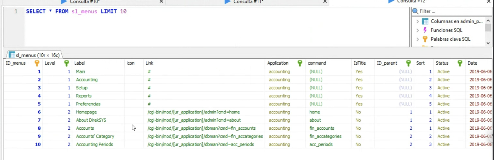

Hay que definir donde colocar el dbman, en este caso se colocara en el modulo setup dentro del menú: Setup→ Menu → Manager

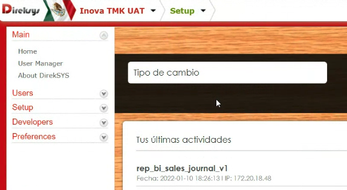

Para agregar datos al menu nos dirigimos a la base la base de sl_menu y registramos el nuevo menu, este es un ejemplo de su insert: hay que notar qu en la ruta dice setup ese se refiere al modulo y por ultimo el comando menuman:

```sql
INSERT INTO sl_menus 
(`Level`,Label,icon,Link,Application,command,IsTitle,ID_parent,Sort,Status,`Date`,`Time`,ID_admin_users,IsDbman,isReport) 
VALUES	 
(2,'Menu','','#','setup',NULL,'Yes',536,6,'Active','2019-06-06','11:07:56',7835,0,0);
	
INSERT INTO uat_direksys2_e2.sl_menus 
(`Level`,Label,icon,Link,Application,command,IsTitle,ID_parent,Sort,Status,`Date`,`Time`,ID_admin_users,IsDbman,isReport) 
VALUES
(3,'Manager','','/cgi-bin/mod/setup/dbman?cmd=menuman','setup','menuman','No',902,1,'Active','2019-06-06','11:07:56',7835,1,0);
```

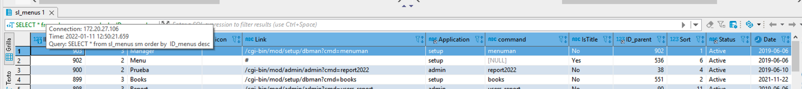

Como lo vimos en el link nos dice  a que modulo pertenece

Nos dirigimos  al archivo setup.ex.cfg

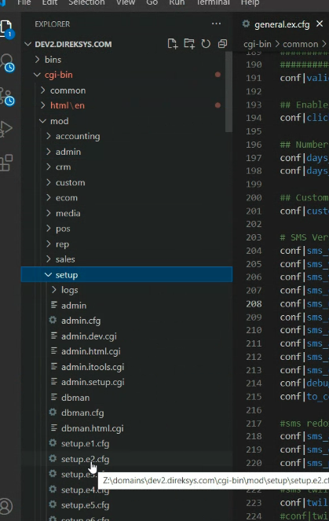

Buscamos el archivó setup.ex.cfg

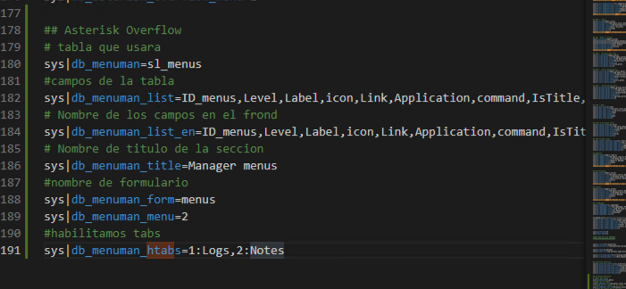

Al tener esto ya podemos acceder al crud generado por dbman

Nos mvemos al modulo ade Setup y ahi en el menu Setup → Manager

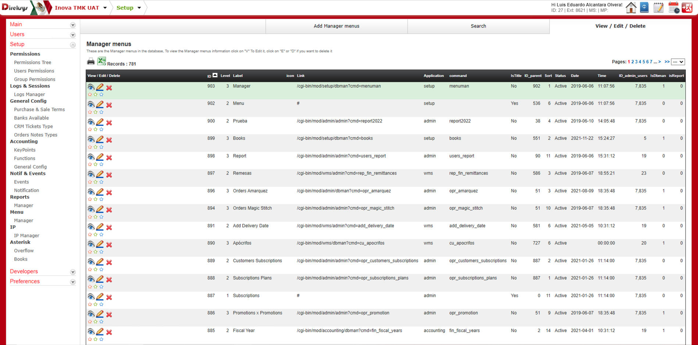

Con esto ya vemos el crud de la tabla que queríamos y podemos acceder a todas las secciones que el doman genera. 

Si se da click en un ojo de esta misma vista

En la parte de abajo queremos agregar Logs y notas algo como esto

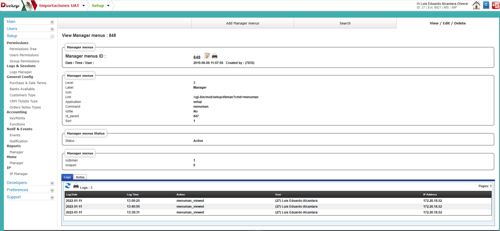

Para lograr que esto se vea primero generaremos la vista de la tab log en el archivo  setup.ex.cfg agregaremos al final la siguiente linea:

``sys|db_menuman_htabs=1:Logs``

Con esa linea le estamos diciendo que genere un tab de log

El código quedaria asi:

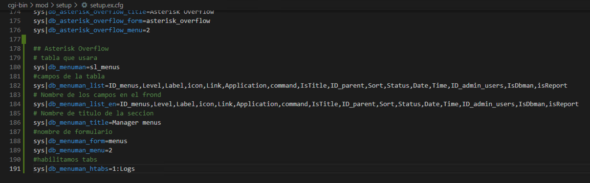

Antes de continuar en la imagen en la linea 188 vemos que en db_menuman_form se agrego el nombre de menus esto es importante ya que sera usado mas delante.

Con lo que se agrego en esa linea le estamos diciendo que va utilizar tab y que uno tendra el id 1 llamado Logs.

Para hacer que esto sea visible en la vista tenemos que crear un archivo llamado menus.cgi que es el mimos que se ve en db_menuman_form:

El archivo lo generamos en cgi-bin→common→tabs→menus.cgi

```perl
#####################################################################
########                   MENUS                      		#########
#####################################################################


sub load_tabsconf {
# --------------------------------------------------------
	if($in{'tab'} eq 1){
		## Notes Tab
		$va{'tab_type'}  = 'logs';
		$va{'tab_title'} = &trans_txt('logs');
		$va{'tab_table'} = 'sl_menus';
	}
}

1;
```

En el caso de menu de log ya exite la tabla sl_menus por lo que no es necesario generar una tabla para guardar su contenido solo en el tab_table se pone el nombre de la tabla:

Esto hace que la vista sea la siguiente en la parte de abajo se ve el tab de Logs:

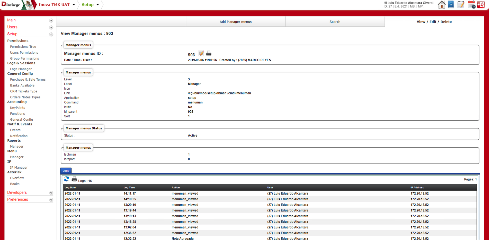

Ahora queremos que salga un log de notas por lo que tendremos que crear esa tabla llamada sl_menus_notes:

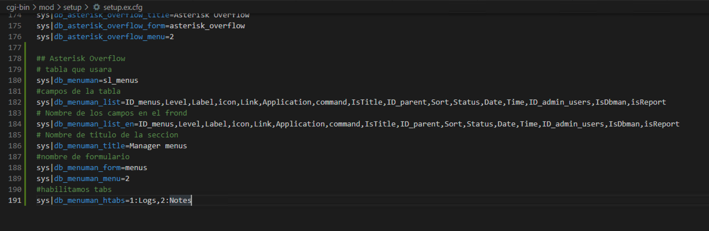

```sql
CREATE TABLE `sl_menus_notes` (
  `ID_menus_notes` int(6) NOT NULL AUTO_INCREMENT,
  `ID_menus` int(6) NOT NULL,
  `Notes` text NOT NULL,
  `Type` enum('High','Medium','Low','Payment Instructions') NOT NULL,
  `Date` date NOT NULL,
  `Time` time NOT NULL,
  `ID_admin_users` int(6) NOT NULL,
  PRIMARY KEY (`ID_menus_notes`),
  KEY `ID_menus` (`ID_menus`),
  KEY `ID_admin_users` (`ID_admin_users`),
  KEY `Type` (`Type`),
  KEY `Date` (`Date`),
  KEY `Time` (`Time`) USING BTREE
) ENGINE=InnoDB AUTO_INCREMENT=1 DEFAULT CHARSET=latin1
```
```sql
select * from sl_menus_notes;
```

Una ves creada la tabla solo tenemos que regresar al archivo de configuracion cgi-bin→mod→setup→setup.ex.cfg y en la linea donde se agrego el tab de log ahora agregamos el nuevo tab

```perl
sys|db_menuman_htabs=1:Logs,2:Notes
```

Como lo vemos en la imagen:

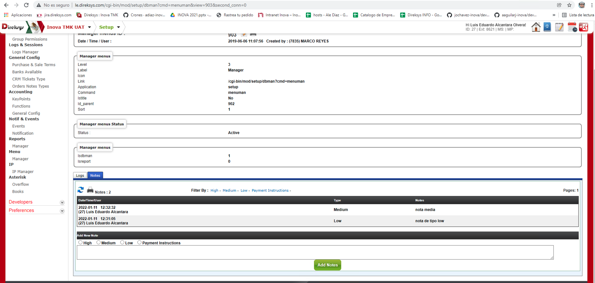

y antes de probar ahora tenemos que modificar el archivo que anteriormente creamos **cgi-bin→common→tabs→menus.cgi** agregando un if para el nuevo tab

Ahora el archivo quedaria asi:

```perl
#####################################################################
########                   MENUS                      		#########
#####################################################################


sub load_tabsconf {
# --------------------------------------------------------
	if($in{'tab'} eq 1){
		## Notes Tab
		$va{'tab_type'}  = 'logs';
		$va{'tab_title'} = &trans_txt('logs');
		$va{'tab_table'} = 'sl_menus';
	}elsif ($in{'tab'} eq 2){
		## Notes Tab
		$va{'tab_type'}  = 'notes';
		$va{'tab_title'} = &trans_txt('notes');
		# tabla que usara
		$va{'tab_table'} = 'sl_menus_notes';
	}
}

1;
```

Ahora si nos vamos al navegador veremos lo siguiente:


Por ultimo si queremos que toda la seccion creada tenga uno sea vista por un usuario nos dirigimos a:

Administración y dentro de administración Users→Menu perms y en esta sección se puede buscar el usuario que uno quiera restringir, al buscar al usuario el sistema empesara a cargar la informacion de ese usuario:

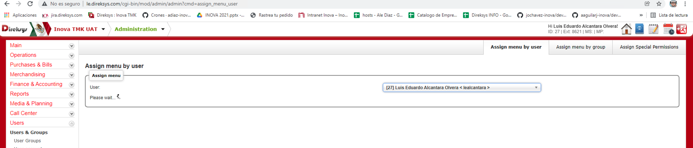

Una ves que cargue veremos lo siguiente:

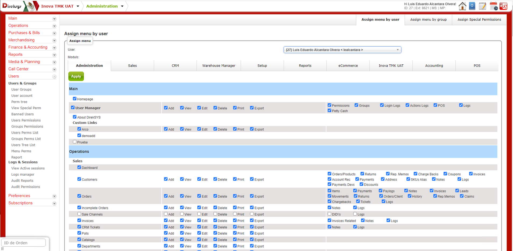

En esa imagen vemos que el usuario buscado tiene diferentes accesos para todos los modulo como lo son:

1. Administration
2. Sales
3. CRM
4. Warehouse Manager
5. Setup
6. Reports
7. eCommerce
8. Inova TMK UAT
9. Acounting
10. POS

Para nuestro caso recordemos que el menu se dio de alta con el link de setup por lo que buscamos en setup y bajamos en busca de la sección:

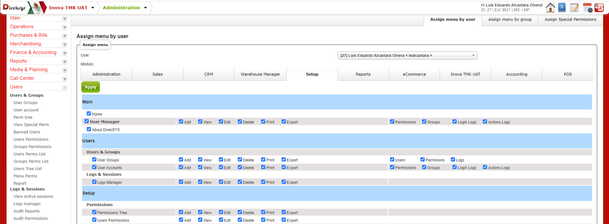

Si bajamos vemos la sección que queremos restringir:

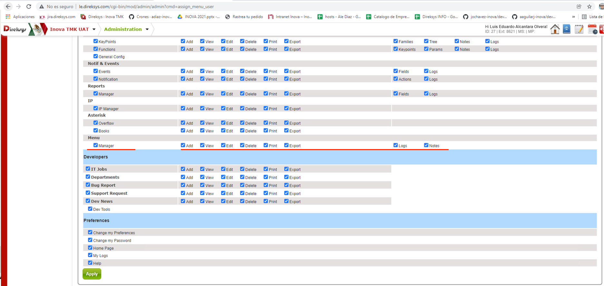

Solo quitamos el check por ejemplo al apartado de add

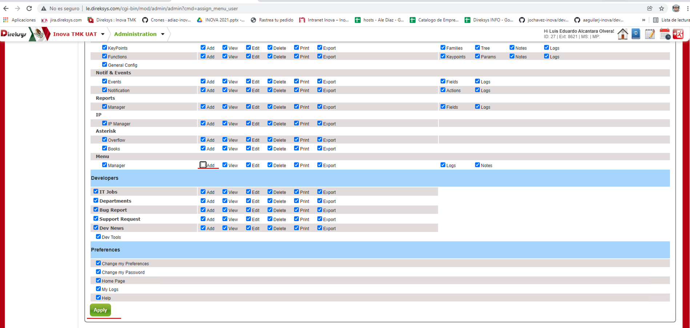

Después de que termine nos vamos de nuevo a nuestra sección de dbman nos cambiamos al modulo de Setup y dentro del modulo en el menu nos vamos a Setup→Menu→Manager  y con eso accedemos a la vista que anteriormente vimos


y si damos click a tab de arriba que dice: Add Manager menus veremos que ahora nos restringió el acceso.

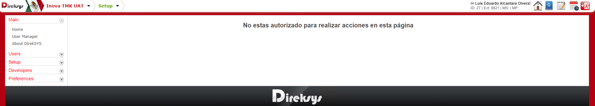

[< Regresar al Inicio](./README.md)