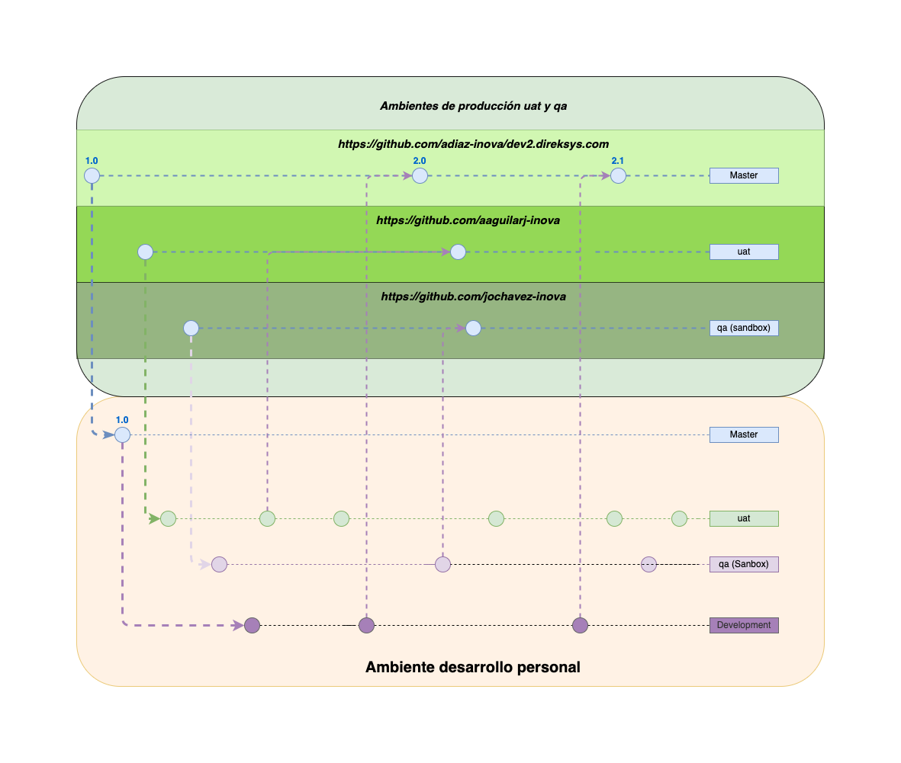

[< Regresar al Inicio](./index.md)

# Git Flow Direksys

Se muestra la imagen que determina el flujo de desarrollo y despliegue de cambios en los 3 ambientes que son:

1. Master
2. uat
3. qa (sandbox)

Se considera que la mejor explicacion deber ser por parte de alguien del equipo ya que escribirla puede ser algo complicado.

Solo solicita que te expliquen este git flow.

[< Regresar al Inicio](./index.md)