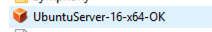
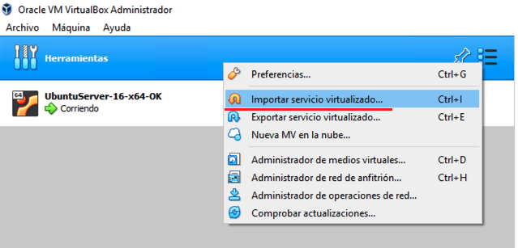
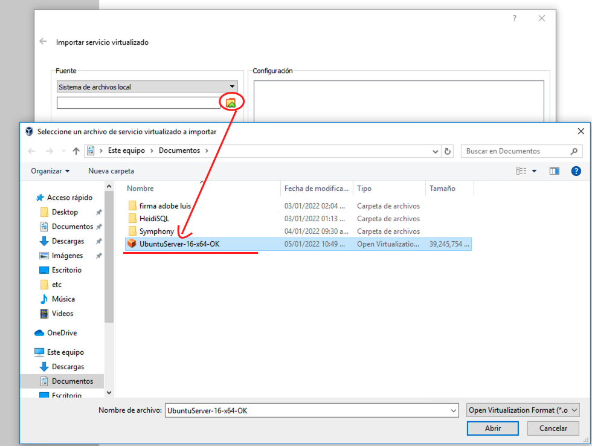
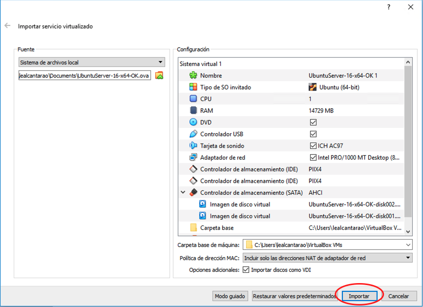
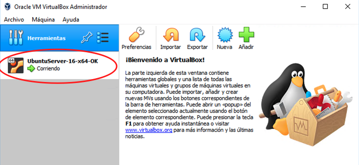
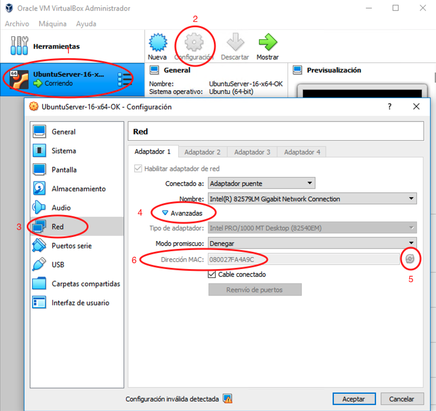

[< Regresar al Inicio](./README.md)
# Montar maquina virtual

Antes de inciar recuerda instalar la ultima version de [VirtualBox](https://www.virtualbox.org/). 

Antes de inicar el prceso se te debe compartir la maquina virtual la cual se puede ver asi (El nombre puede ser otro):

Si VirtualBox ya esta instalado al abrir la aplicación debes dar click derecho en el rectangulo grande que dice Herramientas, esto debe abir un menu en el que debes dar click en la opción: **Importar servicio virtualizado...**

Hay que dar click en la carpeta amarilla con flecha verde. Esto nos abre una ventana en la que tendremos que buscar y seleccionar la imagen que se compartio para poder levantar el sistema:

Una vez seleccionada la imagen se debe dar click en **Importar** esto dara inicio a la importacion de la maquina virtual y este proceso puede tardar. Ve por un cafe en lo que termina ☕☕☕

Una vez que la importacion termine veras algo como esto (No deve estar corriendo). Antes de inicar la maquina debe hacerce una configuración de red en la misma.

Para configurar la Red se enumeran los pasos a seguir, mismos que veras en la imagen:

1. Selecciona la imagen que se configurara.
2. Da click en el boton de **Configuración**
3. En la ventana que se abrio del lado izquierdo da click en **Red**
4. Da click en **Avanzadas**
5. Da click en las flechas en forma de circulo.
6. El paso anterior debio actualizar el contenido de **Dirección MAC**

Estos pasos debieron configurar tu maquina de forma correcta ahora ya puedes **Iniciar** la maquina. 🖖

[< Regresar al Inicio](./README.md)