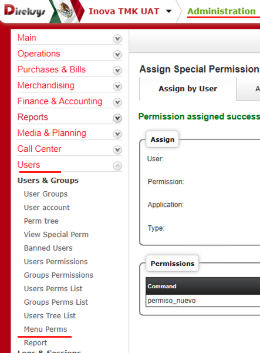

[< Regresar al Inicio](./index.md)
# Permisos especiales

Este permiso se puede usar para restringir todo el acceso a una vista o para restringir el acceso partes especificas de la vista como lo puede ser un boton o un formulario.

Para esto se realiza un insert en la tabla de admin_perms:

```sql
INSERT INTO admin_perms 
(Name,Node,application,command,`type`,tabs,ID_parent,`Path`,Status,`Date`,`Time`,ID_admin_users) 
VALUES 
(' Prueba de permiso especial',NULL,'admin','permiso_nuevo','special',0,NULL,NULL,'Active','2022-01-10','18:27:00',27);
```
Ahora nos podemos ir dentro de direksys en el modulo de Administracion a  Users → Menu Perms



En ese apartado nos dirigimos a ``Assign Special Permissions`` que nos mostrara un formulario


En ese formulario se busca al usuario: se selecciona el permiso y se selecciona el modulo donde se controlara el acceso y en type se pone si tendrá o no acceso:


Por ultimo a nivel de código se tiene que hacer lo siguiente en el metodo correspondiente: donde solo por ejemplo creamos una variable llamada permiso_nuevo la cual sera visible en el front, 

En este código vemos que si al checar el permiso no cuenta con acceso la variable tendrá un texto especificó.


En el front se puede ver la variable generada.


Esto hace que en el sitio se vea lo siguiente:


Si en el apartado de permisos desactivamos el acceso ahora veremos lo siguiente


[< Regresar al Inicio](./index.md)