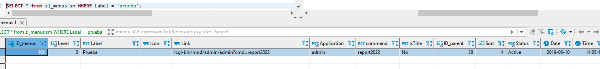
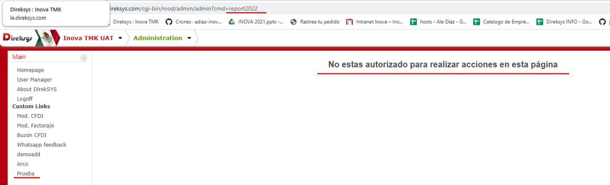
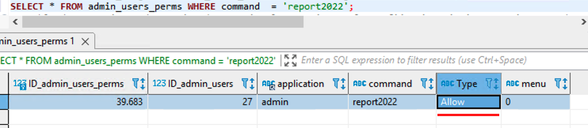
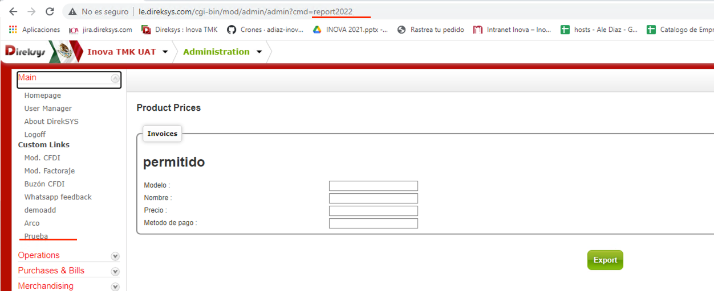

[< Regresar al Inicio](./README.md)

# Permisos

La tabla de ``admin_users_perms`` es la encargada de controlar los permisos de usuario:

```sql
SELECT * FROM admin_users_perms aup ;
```

En este caso se creara un registro nuevo que impedirá acceder por completo a un reporte eso se puede ver en el campo ``Type`` que se registra como ``Disallow``, y en el campo ``command`` se coloca al comando que afectara en este caso ``reporte2022``.

```sql
INSERT INTO admin_users_perms 
(ID_admin_users,application,command,`Type`,menu) 
VALUES 
(27,'admin','report2022','Disallow','0');
```

En este ejemplo vemos que en el campo de command se agrego el comando directo del menu, el cual podemos ver en la tabla de menu donde veremos en el campo link el comando report2022.

```sql
SELECT * from sl_menus sm WHERE Label = 'prueba';
```



Al hacer esto podemos ver que ahora en el sitio la pagina muestra los siguiente:



Si modificamos el permiso de Disallow a Allow podremos ver que la pagina ahora ya es visible:

```sql
SELECT * from admin_users_perms sm WHERE command = 'report2022';
```





[< Regresar al Inicio](./README.md)