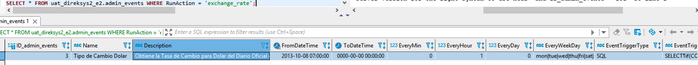

[< Regresar al Inicio](./index.md)

Documentacion: [https://github.com/adiaz-inova/dev2.direksys.com/wiki/Crones](https://github.com/adiaz-inova/dev2.direksys.com/wiki/Crones)

Una vez clonado el repo dev2.cron hay que agregar y bajar cambios del repositorio de adiaz en la rama master.

Agrega primero el repo de adiaz

```bash
git remote add adiaz git@github.com:adiaz-inova/dev2.cron.git
```

si hacemos un

```bash
git remote -v 
```


Con el siguiente comando bajamos cambios de la rama master que pertenece al repositorio de adiaz

```bash
git pull adiaz master
```

Para hacer que el sistema funcione primero hay que configurar como el repo de dev2.direksys.com copiando los archivos que estan en la carpeta:

``\home\www\domains\dev2.cron\bins\ubuntu\general.ex.cfg``

``\home\www\domains\dev2.cron\bins\ubuntu\general.e2.cfg``

Estos 2 archivos se copia y se colocan en la ruta

``\home\www\domains\dev2.cron\bins\general.ex.cfg``

``\home\www\domains\dev2.cron\bins\general.e2.cfg``

La edición de estos archivos es mucha por lo que actualmente se puede ver dentro de la maquina virtual.

Ahora para hacer la prueba buscamos en la tabla **admin_events** el RunAction **exchange_rate**:

```sql
SELECT * FROM uat_direksys2_e2.admin_events WHERE RunAction = 'exchange_rate';
```



Hay que tomar en cuenta que para esta consulta el **ID_admin_events** es 3 ya que este se usara más adelante. 

De esta consulta lo único que se cambiara es el campo de **EmailNotification** donde colocaras tu correo:


Ahora del lado del código  nos dirigimos al archivo:

``\home\www\domains\dev2.cron\bins\subs\sub.func.html.pl``

en este archvo hay un metodo llamado:

```perl
sub event_act_exchange_rate {
```

Que si nos fijamos bien es el mismo nombre que el campo **RunAction** **exchange_rate** solo que aquí se agrega antes: **event_act_** 

Este método lo que hace es actualizar la moneda de cambio por lo que se puede usar como ejemplo sin problema.

Ahora podemos regresar a la base y en la tabla **admin_events_logs** buscamos el **ID_admin_events_logs** (en realidad no importa cual pero como ejemplo podemos buscar el siguiente): **ID_admin_events_logs =** 8850665

```sql
SELECT * FROM 
uat_direksys2_e2.admin_events_logs 
WHERE 
admin_events_logs.ID_admin_events_logs= 8850665;
```

Ahora que ya tenemos identificado esas 2 consultas podemos hacer que se ejecuta nuestro cron:


Para ejecutar el cron dentro de la terminal nos dirigimos a la siguiente ruta:

``cd /home/www/domains/dev2.cron/bins``

y ahi podemos invocar el cron con el comando: 

``perl bgexec.pl 2 3 8850665``

donde :

2 corresponde a la empresa

3 corresponde al admin_events.ID_admin_events (Este lo vimos en la primera consulta)

8850665 corresponde al admin_events_logs.ID_admin_events_logs (Este se vio en la segunda consulta)

Al ejecutar el comando vemos los siguiente en la terminal:


y llega un correo como este:


Y en la base de datos el unico cambio fue que sobrescribio la respuesta en la tabla admin_events_logs en la fila con ``admin_events_logs.ID_admin_events_logs= 8850665;``

```sql
SELECT * FROM
uat_direksys2_e2.admin_events_logs
WHERE
admin_events_logs.ID_admin_events_logs= 8850665;
```

[< Regresar al Inicio](./index.md)