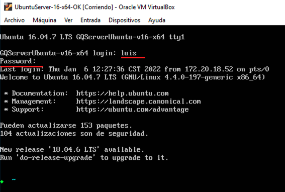
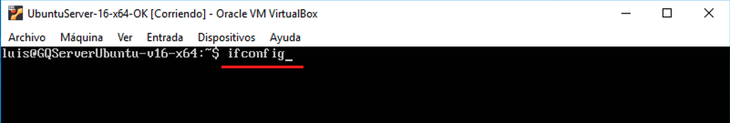
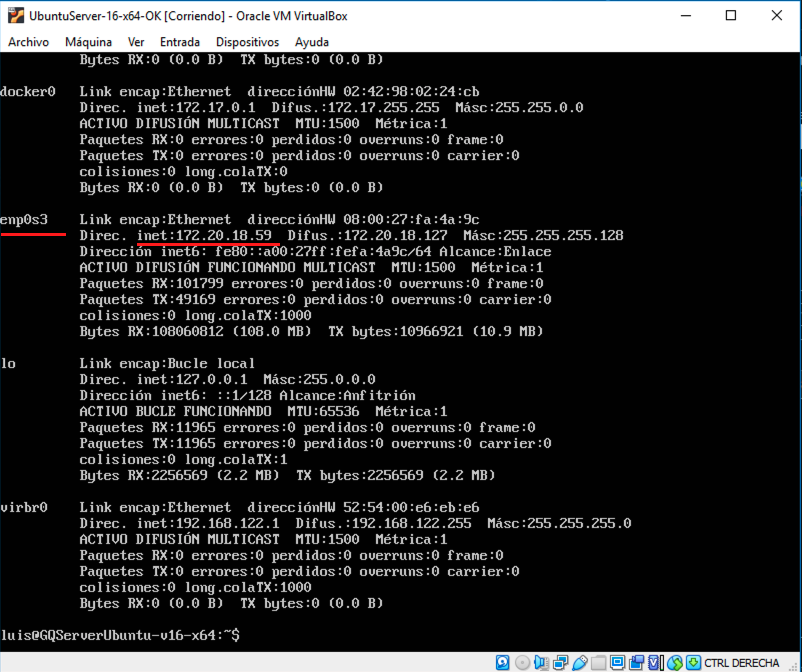

[< Regresar al Inicio](./README.md)

[< Regresar al Crear usuario en linux](./crear-usuario-en-linux.md)

## Saber ip de la maquina virtual
Para saber la ip de la maquina virtual primero hay que iniciar sesion:

Una vez logueado se tiene que escribir: **ifconfig**

Esto nos muestra información sobre la red de la maquina virtual, se tiene que buscar el apartado **enp0s3** en mi caso la ip en ese apartado es: **172.20.18.59** 

[< Regresar al Inicio](./README.md)

[< Regresar al Crear usuario en linux](./crear-usuario-en-linux.md)